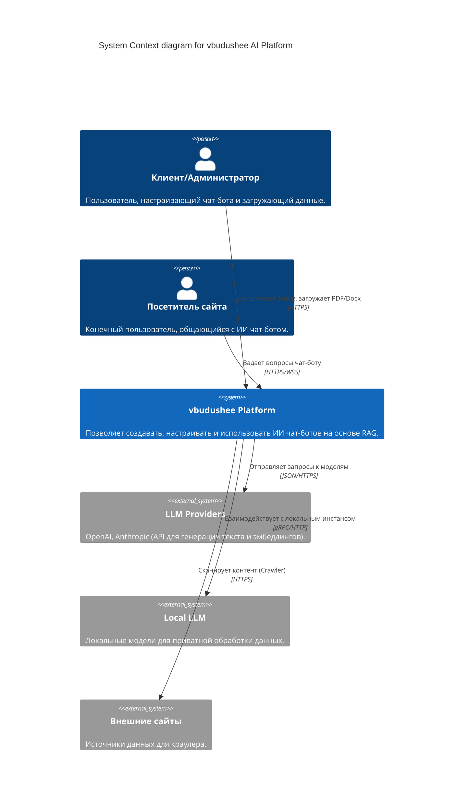
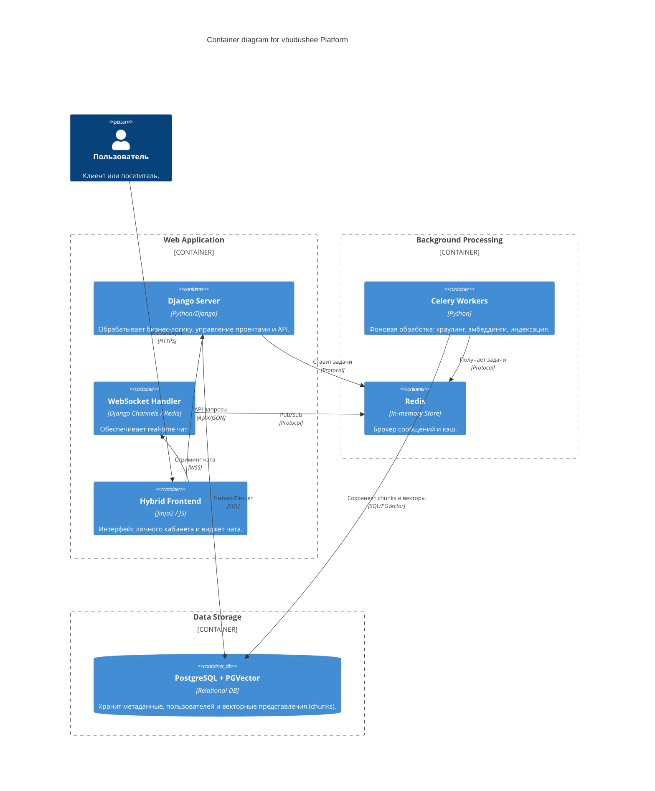
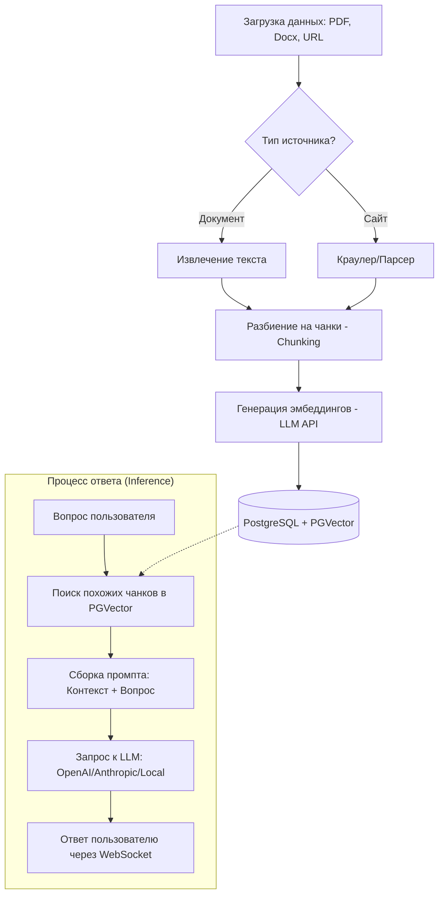

# Архитектурная спецификация проекта vbudushee (Core #1)

## 1. Введение и пояснительная записка
Данный документ описывает высокоуровневую архитектуру платформы «vbudushee» — системы для создания и управления ИИ чат-ботами с использованием технологии RAG (Retrieval-Augmented Generation). 

### Цели системы
- Предоставление внешним клиентам инструментов для «обучения» ИИ на собственных данных (документы, сайты).
- Интеграция обученных чат-ботов в веб-интерфейсы и сторонние ресурсы.
- Поддержка различных LLM-провайдеров (OpenAI, Anthropic) и локальных моделей.

### Архитектурные принципы
- **Гибридный фронтенд**: Использование Django-шаблонов (Jinja2) для SEO-значимых страниц и JS-модулей для динамических интерфейсов чата.
- **Асинхронность**: Тяжелые задачи (парсинг сайтов, генерация эмбеддингов) выносятся в Celery (брокер Redis).
- **Векторный поиск**: Использование расширения PGVector для PostgreSQL для эффективного поиска по семантическим сходствам.
- **Real-time**: Общение с ИИ через WebSocket для мгновенного отображения ответов (стриминг).

---

## 2. C4 Model: Уровень 1 (System Context)

Описывает взаимодействие системы «vbudushee» с внешним миром.

---

## 3. C4 Model: Уровень 2 (Containers)

Детализирует внутренние компоненты платформы.

---

## 4. Архитектурная схема процесса RAG (Flowchart)

Схема того, как данные попадают в систему и превращаются в ответы ИИ.

---

## 5. Дополнительные технические детали

1.  **Масштабируемость**: Использование Celery позволяет горизонтально масштабировать воркеры для обработки больших объемов документов.
2.  **Безопасность**: Доступ к данным ограничен в рамках проекта (Project isolation). Эмбеддинги привязаны к конкретному идентификатору проекта.
3.  **Гибкость моделей**: Архитектура предусматривает абстрактный слой для работы с провайдерами LLM, что позволяет переключаться между OpenAI и локальными решениями без переписывания ядра.
