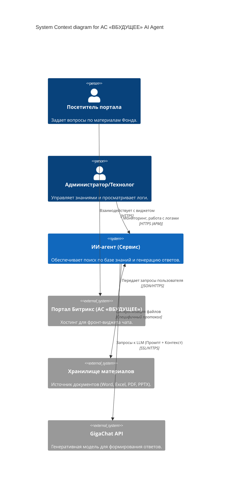
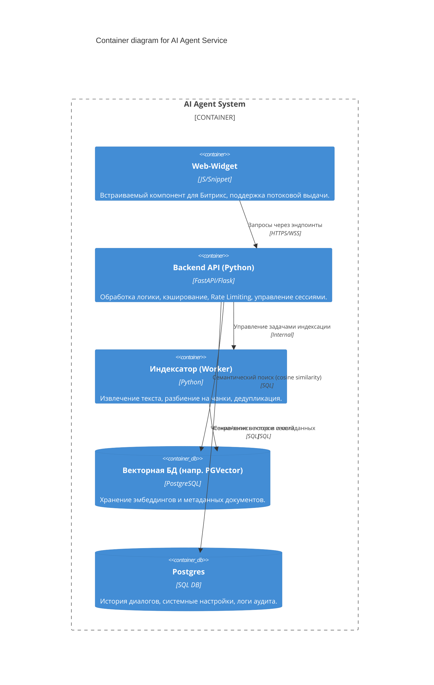
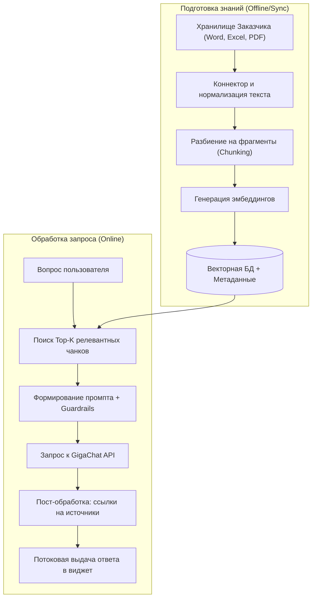

# Архитектурная спецификация сервиса «ИИ-агент-чат-бот» для АС «ВБУДУЩЕЕ»

## 1. Введение и назначение системы

Настоящий документ описывает архитектуру веб-чат-бота, интегрированного в главную страницу портала АС «ВБУДУЩЕЕ». Сервис предназначен для обеспечения круглосуточной поддержки пользователей путем предоставления ответов на основе материалов Заказчика с использованием технологий RAG (Retrieval-Augmented Generation) и GigaChat API.

### Ключевые цели
*   **Автоматизация ответов** по внутренним материалам (Word, Excel, PDF и др.) с обязательным цитированием источников.
*   **Бесшовная интеграция** с порталом на платформе Битрикс.
*   **Обеспечение высокой производительности** (1000+ одновременных сессий).
*   **Соблюдение строгих требований** кибербезопасности и SSDLC.

## 2. C4 Model: Уровень 1 (System Context)

Описывает взаимодействие сервиса чат-бота с экосистемой АС «ВБУДУЩЕЕ» и внешним ИИ-провайдером.

## 3. C4 Model: Уровень 2 (Containers)

Детализация внутренних компонентов сервиса, развернутых на серверах Фонда.

## 4. Архитектурная схема процесса RAG (Flowchart)

Схема обработки данных и формирования ответа:

## 5. Технологические и эксплуатационные требования

### Стек технологий
*   **Язык:** Python (PHP строго запрещен).
*   **ИИ-модуль:** GigaChat API (поддержка версии MAX и выше).
*   **База данных:** PostgreSQL + Векторное расширение.
*   **Развертывание:** Docker-контейнеры, совместимость с Kubernetes.
*   **Мониторинг:** Формат Prometheus, логирование в JSON.

### Безопасность и надежность
*   **Защита от инъекций:** Валидация промптов, фильтры безопасности (Guardrails).
*   **Изоляция сессий:** Разделение контекста и памяти между пользователями.
*   **SLA/SLO:** Время ответа < 20 сек для 90-го процентиля при нагрузке 1000+ сессий.
*   **Гарантия:** 1 год технической поддержки и устранение критических уязвимостей в течение 5 часов.
