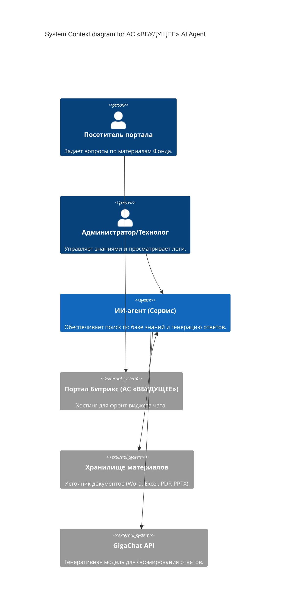
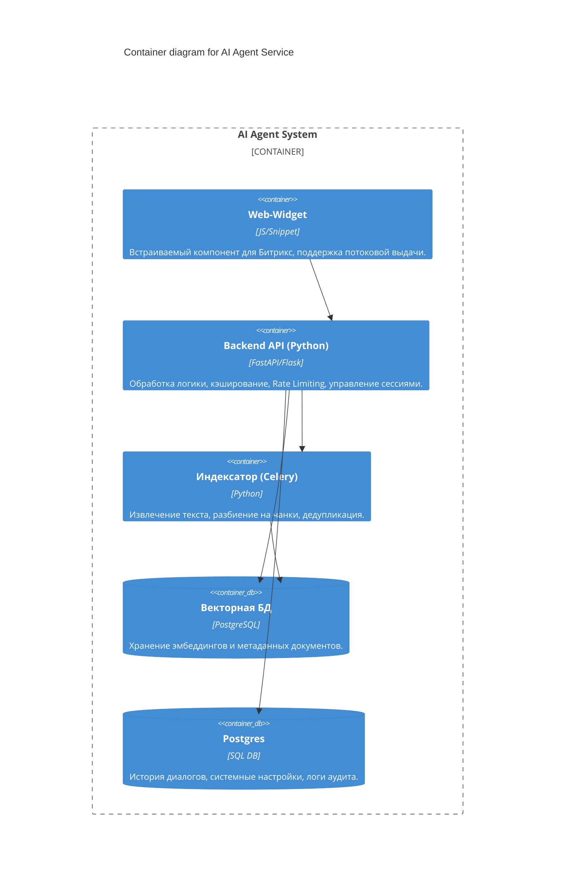
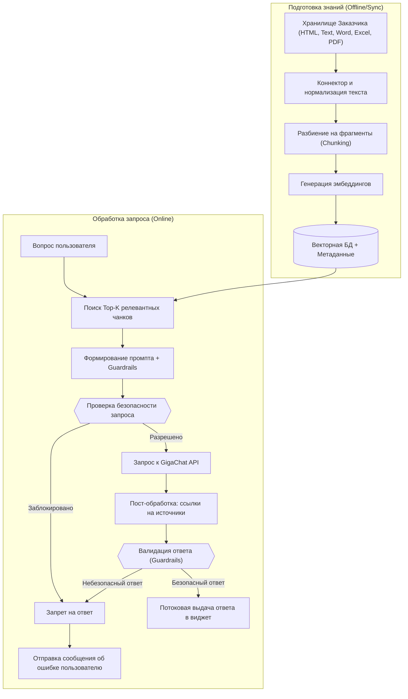

# Архитектурная спецификация сервиса «ИИ-агент-чат-бот» для АС «ВБУДУЩЕЕ»

## 1. Введение и назначение системы

Настоящий документ описывает архитектуру веб-чат-бота, интегрированного в главную страницу портала АС «ВБУДУЩЕЕ». Сервис предназначен для обеспечения круглосуточной поддержки пользователей путем предоставления ответов на основе материалов Заказчика с использованием технологий RAG (Retrieval-Augmented Generation) и GigaChat API.

### Ключевые цели

* **Автоматизация ответов** по внутренним материалам (Word, Excel, PDF и др.) с обязательным цитированием источников.
* **Бесшовная интеграция** с порталом на платформе Битрикс.
* **Обеспечение высокой производительности** (1000+ одновременных сессий).
* **Соблюдение строгих требований** кибербезопасности и SSDLC.

## 2. C4 Model: Уровень 1 (System Context)

Описывает взаимодействие сервиса чат-бота с экосистемой АС «ВБУДУЩЕЕ» и внешним ИИ-провайдером.



Легенда (System Context):
```text
Посетитель портала -> Портал Битрикс:
  работа с чат-виджетом по HTTPS.

Портал Битрикс -> ИИ-агент (Сервис):
  передача запросов пользователя в backend (JSON/HTTPS).

ИИ-агент (Сервис) -> GigaChat API:
  отправка промпта и контекста к LLM (SSL/HTTPS).

ИИ-агент (Сервис) -> Хранилище материалов:
  синхронизация документов для базы знаний.

Администратор/Технолог -> ИИ-агент (Сервис):
  мониторинг и работа с логами через АРМ.
```

## 3. C4 Model: Уровень 2 (Containers)

Детализация внутренних компонентов сервиса, развернутых на серверах Фонда.



Легенда (Containers):
```text
Web-Widget -> Backend API (Python):
  пользовательские запросы и потоковая выдача (HTTPS/WSS).

Backend API (Python) -> Векторная БД:
  семантический поиск по эмбеддингам (SQL).

Backend API (Python) -> Postgres:
  хранение сессий, истории диалогов и аудита (SQL).

Индексатор (Worker) -> Векторная БД:
  запись эмбеддингов и метаданных документов (SQL).

Backend API (Python) -> Индексатор (Worker):
  запуск и контроль задач индексации (internal API/queue).
```

## 4. Архитектурная схема процесса RAG (Flowchart)

Схема обработки данных и формирования ответа:


## 5. Технологические и эксплуатационные требования

### Стек технологий

* **Язык:** Python.
* **ИИ-модуль:** GigaChat API (поддержка версии MAX и выше), модели для построения embedder векторов
* **База данных:** PostgreSQL + Векторное расширение.
* **Развертывание:** Docker-контейнеры, совместимость с Kubernetes.
* **Мониторинг:** Формат Prometheus, логирование в JSON.

### Безопасность и надежность

* **Защита от инъекций:** Валидация промптов, фильтры безопасности (Guardrails).
* **Изоляция сессий:** Разделение контекста и памяти между пользователями.
* **SLA/SLO:** Время ответа < 20 сек для 90-го процентиля при нагрузке 1000+ сессий.
