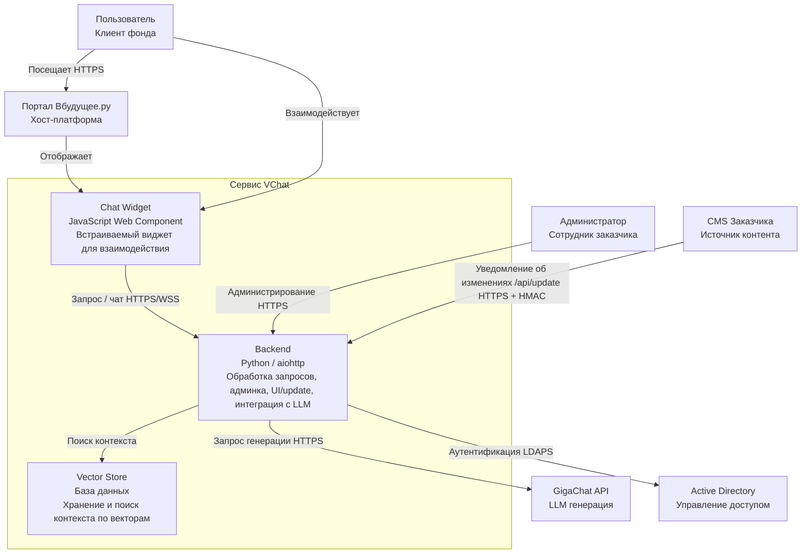
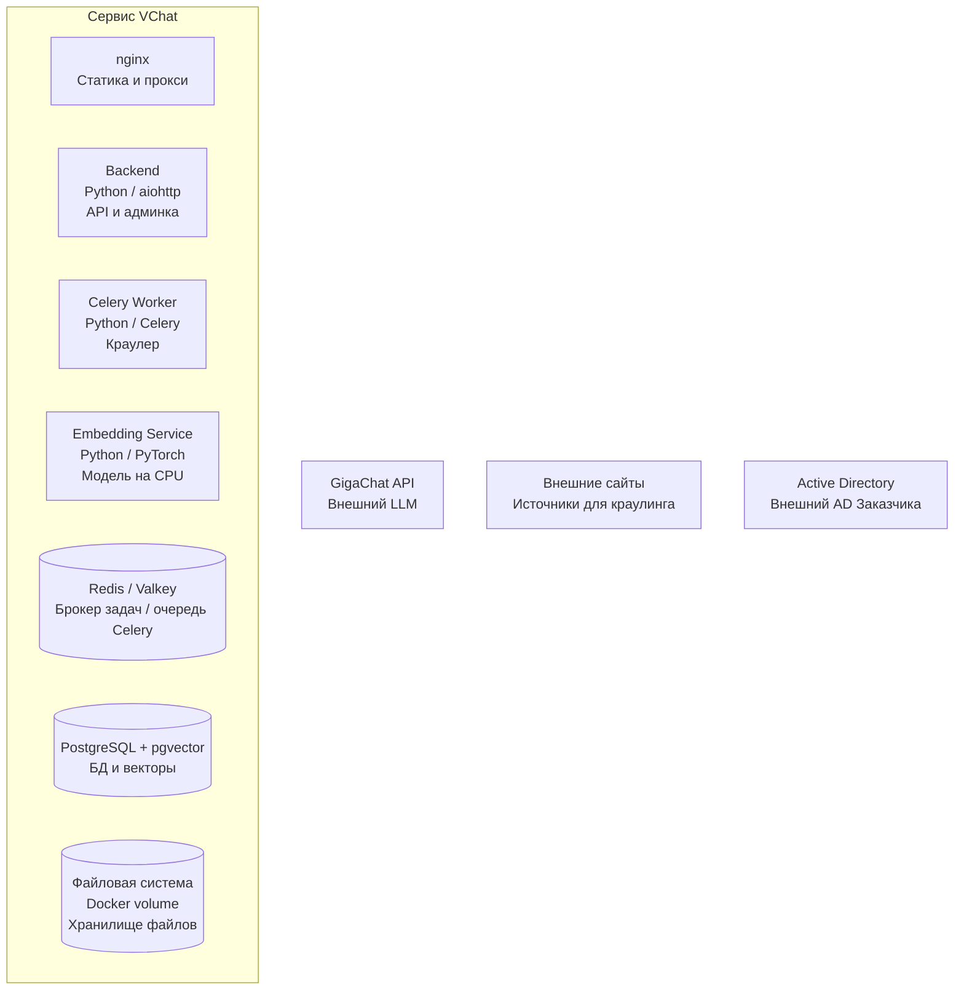
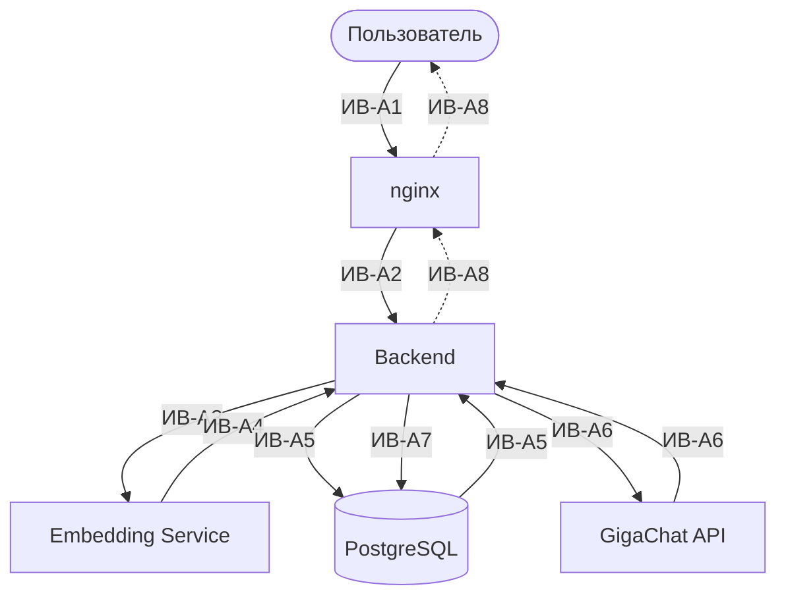
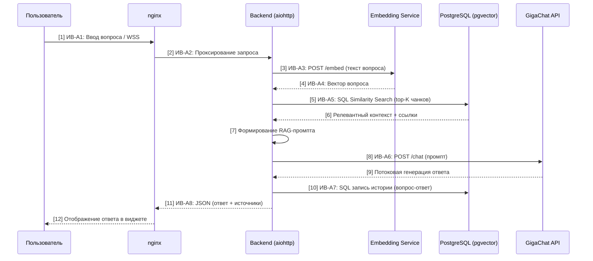
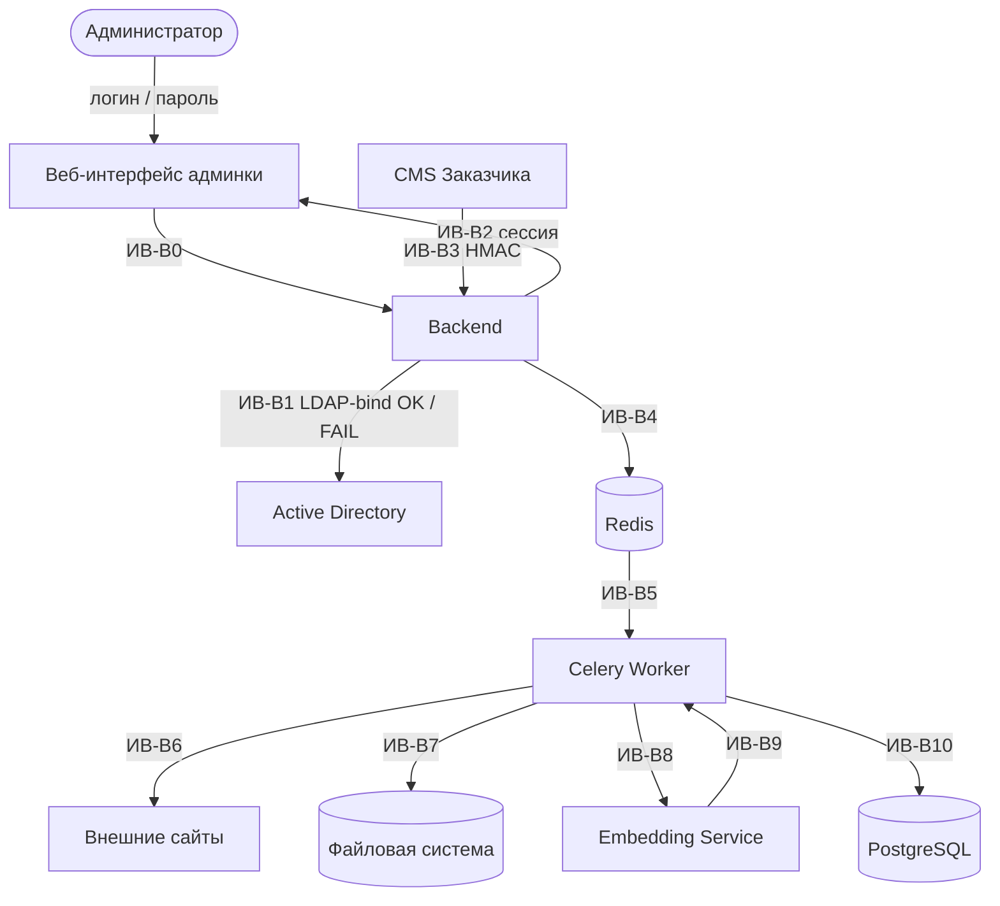
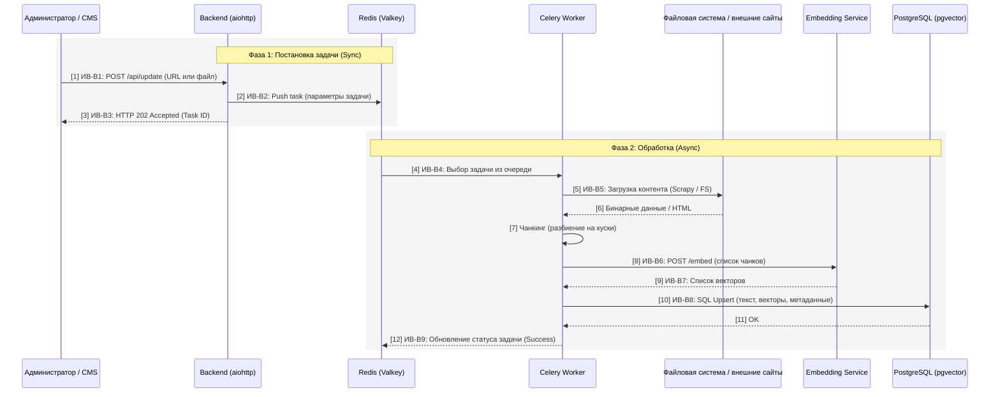
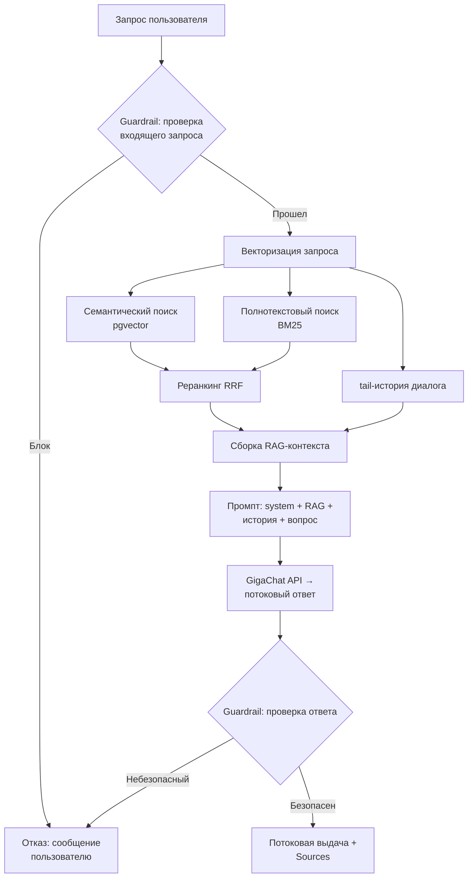
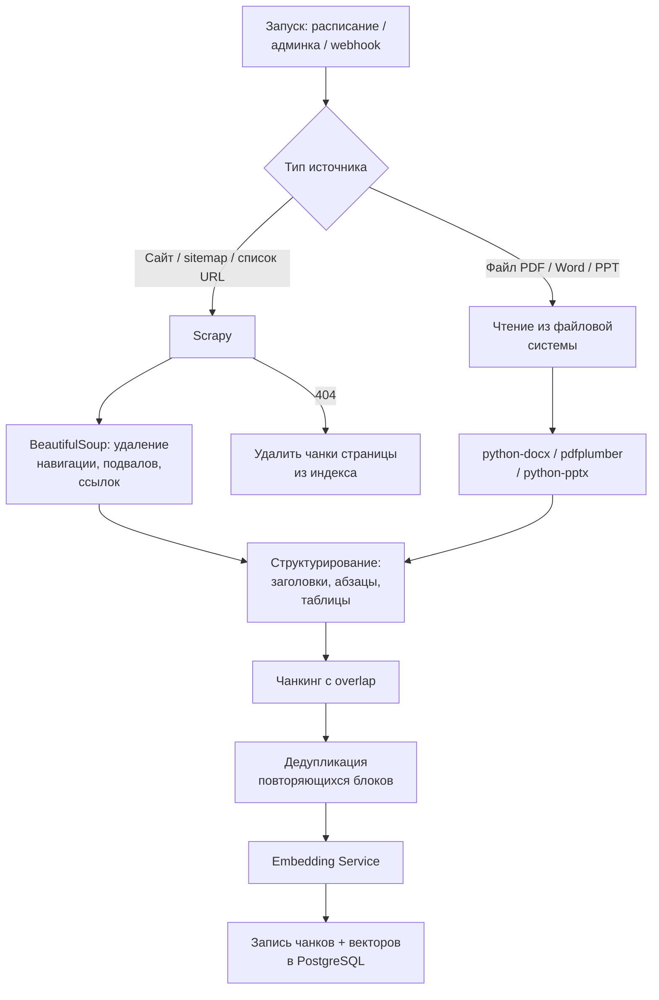

# АРХИТЕКТУРНАЯ СХЕМА И ПОЯСНИТЕЛЬНАЯ ЗАПИСКА

# 1. Введение и назначение системы

Настоящий документ описывает архитектуру веб-чат-бота, интегрированного в главную страницу портала АС «ВБУДУЩЕЕ». Сервис предназначен для обеспечения круглосуточной поддержки пользователей путем предоставления ответов на основе материалов Заказчика с использованием технологий RAG (Retrieval-Augmented Generation) и GigaChat API.

## 1.1 Ключевые цели

- Автоматизация ответов по внутренним материалам (Word, PDF и др.) с обязательным цитированием источников.

- Бесшовная интеграция с порталом Вбудущее.ру.

- Обеспечение высокой производительности: 1000+ одновременных открытых сессий.

- Соблюдение строгих требований кибербезопасности и SSDLC.

# 2. C4 Model: Уровень 1 — System Context

Описывает взаимодействие сервиса чат-бота с экосистемой АС «Вбудущее.ру» и внешним ИИ-провайдером.

*Рисунок 1. C4 Level 1 — System Context*

Легенда (System Context):

- Пользователь: взаимодействует с виджетом на странице портала по HTTPS.

- Портал Вбудущее.ру: страницы включают ссылку на JS-виджет, который расположен на сервере бэкенда виджета. При активации виджет открывает WebSocket соединение к бэкенду ИИ-агента через HTTPS.

- ИИ-агент (Система): обрабатывает запрос: строит RAG-контекст на основе эмбеддингов, формирует промпт и получает ответ от GigaChat API, возвращает результат пользователю потоком.

- База данных: PostgreSQL + pgvector: хранит векторные эмбеддинги чанков, историю диалогов и системные настройки.

- Краулер / Индексатор: обходит внешние источники (сайты, загруженные документы), формирует чанки, строит эмбеддинги и записывает их в базу данных.

- GigaChat API: внешний LLM-сервис для генерации текстовых ответов на основе переданного RAG-промпта.

- Внешние источники: публичные веб-сайты Фонда, обходимые краулером по расписанию или по запросу.

# 3. C4 Model: Уровень 2 — Containers

Раздел показывает компоненты сервиса VChat и потоки данных в двух основных сценариях. Диаграмма 3.1 — инвентаризация контейнеров без стрелок. Диаграммы 3.2 и 3.3 описывают потоки данных в каждом сценарии отдельно: запрос пользователя и индексация контента.

## 3.1 Инвентаризация контейнеров

*Рисунок 2.* *C4 Level 2* *— Инвентаризация контейнеров*

Краткое назначение контейнеров:

- nginx — раздача статики виджета (widget.js) и админки; reverse proxy для WebSocket/HTTP от виджета к Backend; терминация TLS.

- Backend — Python/aiohttp. Обрабатывает WebSocket от виджета, REST-запросы админки и сервис для уведомлений от других сервисов фонда через авторизированные вебхуки по адресу /api/update. Управляет RAG-конвейером, guardrails, сессиями.

- Celery Worker — Python/Celery. Объединяет краулер и индексатор: обход сайтов (Scrapy), парсинг файлов (python-docx, pdfplumber, python-pptx), чанкинг, отправка чанков в Embedding Service, запись в PostgreSQL.

- Embedding Service — отдельный контейнер с моделью Giga-Embeddings-instruct (ai-sage). Работает на CPU. Принимает текст, возвращает вектор. Обслуживает Backend (запросы пользователей) и Celery Worker (чанки контента).

- Redis / Valkey — брокер очереди задач Celery. Используется только в сценарии индексации; запросы пользователей через очередь не проходят.

- PostgreSQL + pgvector — единый инстанс. Разграничение доступа на уровне ролей: Backend читает/пишет таблицы диалогов; Celery Worker пишет таблицы чанков и источников.

- Файловая система — Docker volume. Файлы (Word/PDF/PPT), загруженные администратором через интерфейс админки.

## 3.2 Сценарий A — Запрос пользователя в чат-бот

Поток данных при обращении пользователя к ИИ-агенту через виджет.

*Рисунок 3. C4 Level 2 — Инвентаризация контейнеров*

***Таблица взаимодействий (Сценарий A):***

|  |  |  |  |  |  |  |
|:--:|:--:|:--:|:--:|:--:|:--:|:--:|
| ***№*** | ***Источник*** | ***Приёмник*** | ***Протокол*** | ***Безопасность*** | ***Описание*** | ***Данные*** |
| *ИВ-A1* | *Пользователь (браузер)* | *nginx* | *HTTPS / WebSocket* | *TLS 1.2+* | *Запрос виджета или передача вопроса* | *widget.js / текст вопроса* |
| *ИВ-A2* | *nginx* | *Backend* | *HTTP / WS (внутр.)* | *Внутр. сеть* | *Reverse proxy запроса* | *Текст вопроса, session_id* |
| *ИВ-A3* | *Backend* | *Embedding Service* | *HTTP (внутр.)* | *Внутр. сеть* | *Запрос на векторизацию вопроса* | *Текст вопроса* |
| *ИВ-A4* | *Embedding Service* | *Backend* | *HTTP (внутр.)* | *Внутр. сеть* | *Возврат вектора* | *Вектор* |
| *ИВ-A5* | *Backend* | *PostgreSQL* | *SQL (TLS)* | *Роль backend_reader* | *Семантический + полнотекстовый поиск; чтение истории диалога* | *SQL-запрос; топ-K чанков* |
| *ИВ-A6* | *Backend* | *GigaChat API* | *HTTPS* | *TLS 1.2+, API-ключ* | *Отправка RAG-промпта, потоковая генерация ответа* | *Промпт; ответ — токены* |
| *ИВ-A7* | *Backend* | *PostgreSQL* | *SQL (TLS)* | *Роль backend_writer* | *Запись пары «вопрос-ответ» в историю* | *session_id, вопрос, ответ* |
| *ИВ-A8* | *Backend (через nginx)* | *Пользователь* | *WebSocket / HTTPS* | *TLS 1.2+* | *Потоковая выдача ответа и списка Sources* | *Текст ответа, ссылки на источники* |

*Redis в этом сценарии не используется — он задействован только при индексации контента (Сценарий B).*

*Рисунок 4. Sequence Diagram (Сценарий A) — Детализацию процесса обработки сообщения*

## 3.3 Сценарий B — Индексация контента

Поток данных при наполнении базы знаний. Включает два пути запуска: вручную через админку (с предварительной аутентификацией в AD) и автоматически по webhook от CMS Заказчика.

*Рисунок 5. Сценарий B — поток индексации контента*

**Таблица взаимодействий (Сценарий B):**

|  |  |  |  |  |  |  |
|:--:|:--:|:--:|:--:|:--:|:--:|:--:|
| ***№*** | ***Источник*** | ***Приёмник*** | ***Протокол*** | ***Безопасность*** | ***Описание*** | ***Данные*** |
| *ИВ-B0* | *Веб-интерфейс админки* | *Backend* | *HTTPS* | *TLS 1.2+* | *Передача credentials администратора для проверки* | *Логин, пароль* |
| *ИВ-B1* | *Backend* | *Active Directory* | *LDAPS* | *Bind под ТУЗ из env* | *Проверка credentials в корпоративном AD* | *DN, пароль; ответ OK/FAIL* |
| *ИВ-B2* | *Backend* | *Веб-интерфейс админки* | *HTTPS* | *Сессионный токен* | *Создание сессии после успешного LDAP-bind* | *session_token* |
| *ИВ-B3* | *CMS Заказчика* | *Backend (/api/update)* | *HTTPS* | *HMAC-SHA256 + client_id* | *Уведомление об изменении страницы или документа* | *url, client_id, signature* |
| *ИВ-B4* | *Backend* | *Redis* | *Redis-протокол* | *Внутр. сеть* | *Постановка задачи индексации в очередь Celery* | *task_payload* |
| *ИВ-B5* | *Redis* | *Celery Worker* | *Redis-протокол* | *Внутр. сеть* | *Получение задачи воркером* | *task_payload* |
| *ИВ-B6* | *Celery Worker* | *Внешний сайт* | *HTTP / HTTPS* | *—* | *Скачивание HTML (Scrapy)* | *HTML-контент* |
| *ИВ-B7* | *Celery Worker* | *Файловая система* | *file I/O* | *Права контейнера* | *Чтение файлов, загруженных администратором* | *Word / PDF / PPT* |
| *ИВ-B8* | *Celery Worker* | *Embedding Service* | *HTTP (внутр.)* | *Внутр. сеть* | *Векторизация чанков* | *Список чанков* |
| *ИВ-B9* | *Embedding Service* | *Celery Worker* | *HTTP (внутр.)* | *Внутр. сеть* | *Возврат векторов* | *Векторы dim=2048* |
| *ИВ-B10* | *Celery Worker* | *PostgreSQL* | *SQL (TLS)* | *Роль worker_writer* | *Запись чанков, векторов, метаданных источника* | *INSERT в chunks, sources* |

*Рисунок 6. Сценарий B — Индексация контента*

Описание этапов Сценария B:

- Разделение ответственности: Бэкенд на aiohttp не ждет окончания краулинга. Он только записывает задачу в Redis (ИВ-B2) и сразу отвечает пользователю (ИВ-B3), что задача принята. Это обеспечивает высокую отзывчивость админки.

- Работа Celery Worker: Воркер забирает задачу и выполняет «грязную» работу: идет на внешние сайты или в файловую систему (ИВ-B5), парсит документы и делит их на смысловые фрагменты (чанки).

- Массовая векторизация: В отличие от сценария запроса, здесь воркер может отправлять чанки в Embedding Service (ИВ-B6) пачками (batch processing) для ускорения.

- Атомарная запись: Все данные (текст чанка + его вектор + ссылка на источник) записываются в PostgreSQL (ИВ-B8). Благодаря pgvector, данные сразу становятся доступны для поиска в Сценарии А.

# 4. C4 Model: Уровень 3 — Логика Backend (RAG-конвейер)

Детализация внутренней логики Backend при обработке пользовательского запроса (Сценарий A) в части RAG.

*Рисунок 7. Логика Backend — RAG-конвейер*

Критерии блокировки (подробнее см. 05_security_policies.md):

- До запроса к GigaChat: prompt injection, токсичный контент, запрос вне тематики сервиса.

- После ответа GigaChat: обнаружение ПДн РФ (локальные регулярные выражения), фильтрация внешних URL (разрешен только whitelist), проверка на NSFW и повторный контроль Prompt Injection в тексте ответа. Точность ответа гарантируется на этапе извлечения данных методом Reciprocal Rank Fusion (RRF), что исключает использование не релевантного контекста.

# 5. C4 Model: Уровень 3 — Логика Celery Worker (индексация)

Детализация внутренней логики Celery Worker при обработке задач индексации (Сценарий B).

*Рисунок 8. Логика Celery Worker — индексация*

# 6. Технологические и эксплуатационные требования

## 6.1 Стек технологий

- **Язык:** Python 3**.**

- **Web-фреймворк:** aiohttp**.**

- **LLM:** GigaChat API (версия MAX и выше) — только генерация ответов.

- **Эмбеддинг:** Giga-Embeddings-instruct (ai-sage), self-hosted, CPU.

- **Парсинг файлов:** библиотеки для обработки допустимых форматов файлов с конечным преобразованием в markdown формат, python-docx, pdfplumber, python-pptx.

- **Парсинг HTML:** Scrapy, с финальным преобразованием в текстовый формат.

- **База данных:** PostgreSQL + расширение pgvector.

- **Очередь задач:** Redis / Valkey + Celery.

- **Веб-сервер / proxy:** nginx — раздача статики, reverse proxy, терминация TLS.

- **Хранилище файлов:** Файловая система сервера / Docker volume.

- **Аутентификация админки:** LDAP (python-ldap) → Active Directory Заказчика.

- **Контейнеризация:** Docker.

- **CI/CD:** GitLab CI — сборка и публикация Docker-образов; статический анализ (Bandit, линтинг).

- **Метрики:** prometheus_client — экспорт через /metrics. Выбор системы визуализации — на стороне Заказчика.

- **Логирование:** Структурированные JSON-логи в stdout.

## 6.2 Источники документов для базы знаний

Система поддерживает два способа пополнения базы знаний:

- **Краулинг веб-страниц:** автоматический обход сайтов по расписанию или вручную через эндпоинт GET /api/update (с HMAC-подписью). Стратегия приоритизации описана в документе 09_project_sites_indexing_strategy.md.

- **Интерфейс администратора:** загрузка файлов (Word, PDF, PowerPoint) и текстовых инструкций напрямую через веб-интерфейс админки. Источники, статус индексации и журнал событий доступны там же. Доступ к админке — после аутентификации в корпоративном AD по LDAP.

Помимо этого интерфейс администратора позволяет просматривать и изменять: Источники, журнал индексации и событий, и системные настройки доступны через встроенный веб-интерфейс администратора. Доступ к интерфейсу осуществляется по логину и паролю. Пароли хранятся в БД в захэшированном виде (SHA-512 с солью). Доступ должен осуществляется через защищенное соединение HTTPS, с ограничениями средствами сетевой инфраструктуры Заказчика (VPN или выделенный домен с ограничением по IP).

## 6.3 Развертывание и масштабирование

CI/CD-конвейер на базе GitLab CI собирает Docker-образы всех компонентов (Backend, Celery Worker, Embedding Service, nginx) и публикует их в Container Registry. Образы передаются Заказчику для развертывания на собственной инфраструктуре. Выбор среды оркестрации (Docker Compose, Kubernetes или иное) остаётся на стороне клиента.

Горизонтальное масштабирование обеспечивается stateless-архитектурой Backend и Celery Worker: возможен запуск произвольного числа реплик. Единственный stateful-компонент — PostgreSQL + pgvector. Через Redis / Valkey осуществляется управление очередью задач Celery.

## 6.4 Безопасность и надежность

- Защита от инъекций: валидация промптов, многоуровневые guardrails.

- Изоляция сессий: разделение контекста и истории диалога между пользователями.

- Аутентификация админки: LDAP в корпоративном AD Заказчика.

- Аутентификация /api/update: HMAC-SHA256 + client_id, привязанный к конкретному источнику.

- SLA/SLO: время ответа менее 20 сек для 90-го процентиля при нагрузке 1 000+ одновременных сессий; целевая доступность 99%.

- Подробные политики безопасности — в документе 05_security_policies.

# Приложение A. Комментарии из исходного DOCX

| ID | Автор | Дата | Комментарий |
| --- | --- | --- | --- |
| 4 | Широков Анатолий Александрович | 2026-05-22 11:18 UTC | Легенда не совпадает с рисунком. Пользователь, Портал, GigaChat API и дальнейшие элементы съехали. Система на схеме состоит из 3 частей, но по легенде БД отдельно. Нужно либо описать элементы отдельно, либо описать все в одном. Краулера, внешних источников, AD, CMS и администратора нет в легенде. |
| 7 | Широков Анатолий Александрович | 2026-05-22 11:29 UTC | На первой схеме отражены 3 элемента, здесь уже 7 элементов. Если это детализация, нужно внутри квадрата сервиса VChat показать элементы из рисунка 1, чтобы схемы согласовывались между собой. |
| 9 | Широков Анатолий Александрович | 2026-05-22 11:24 UTC | Добавить порты. После определения IP-адресов эта таблица будет главным источником для настройки правил сетевых взаимодействий. |
| 10 | Широков Анатолий Александрович | 2026-05-22 11:26 UTC | По схеме пункты 6 и 9 не описаны в таблице. Если нужна обратная связь с СУБД и GigaChat, это нужно отражать. |
| 11 | Широков Анатолий Александрович | 2026-05-27 15:41 UTC | Появляются ручки, не описанные в документе 02_openapi_specification. Требуется их описать. |
| 15 | Широков Анатолий Александрович | 2026-05-22 11:33 UTC | Аналогично: перепроверить. Например, сейчас ИВ-B9 на схеме между Celery Worker и Redis, а в таблице указана другая информация. |
| 24 | Широков Анатолий Александрович | 2026-05-27 15:43 UTC | Не совпадает с описанием в другом документе. |
