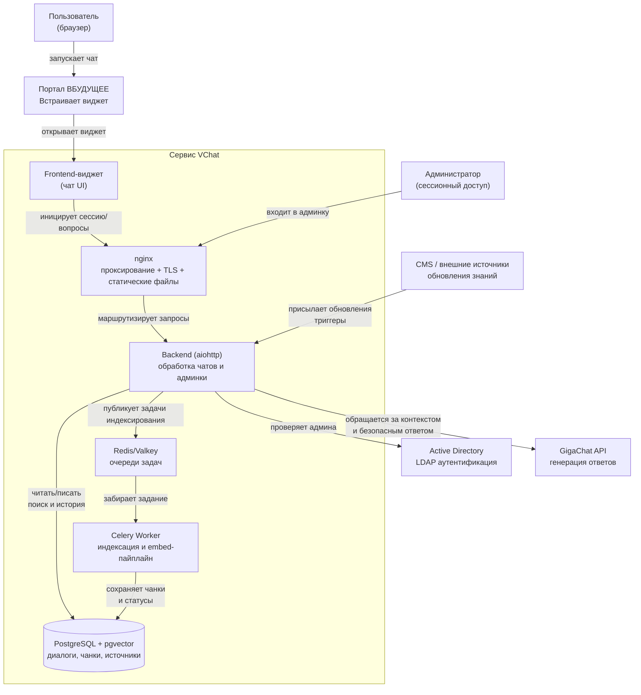
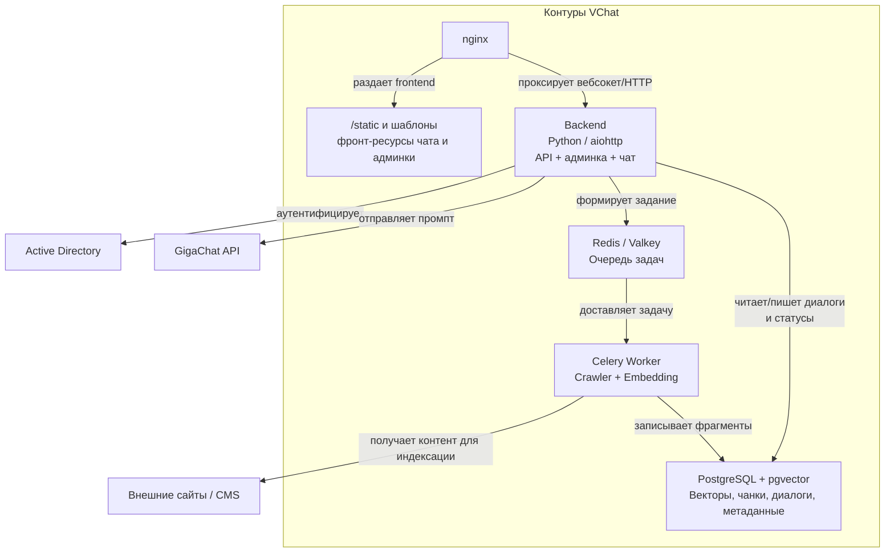
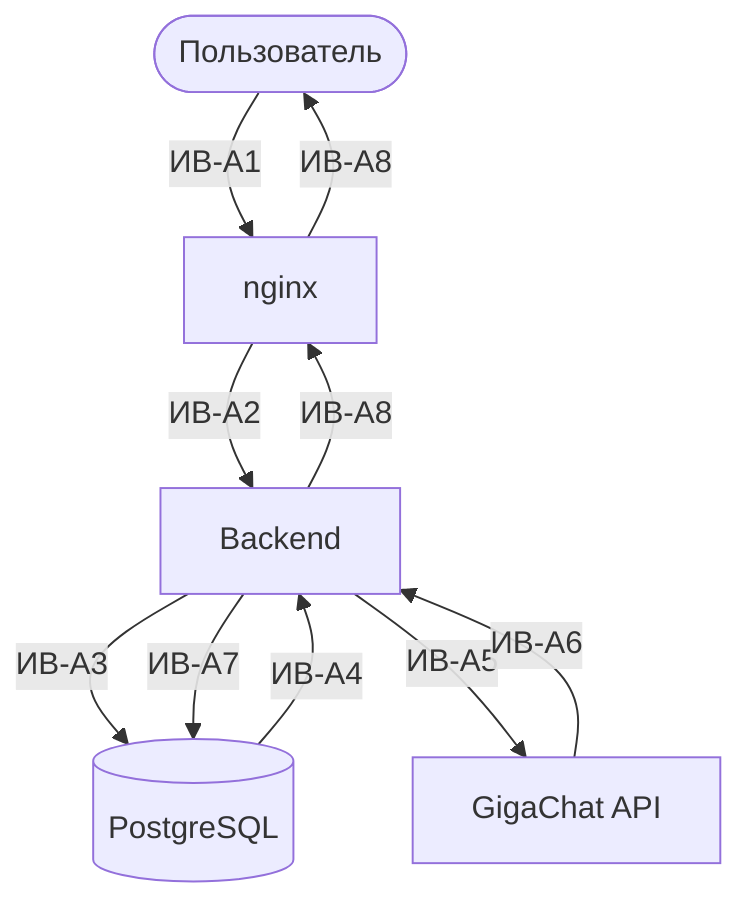
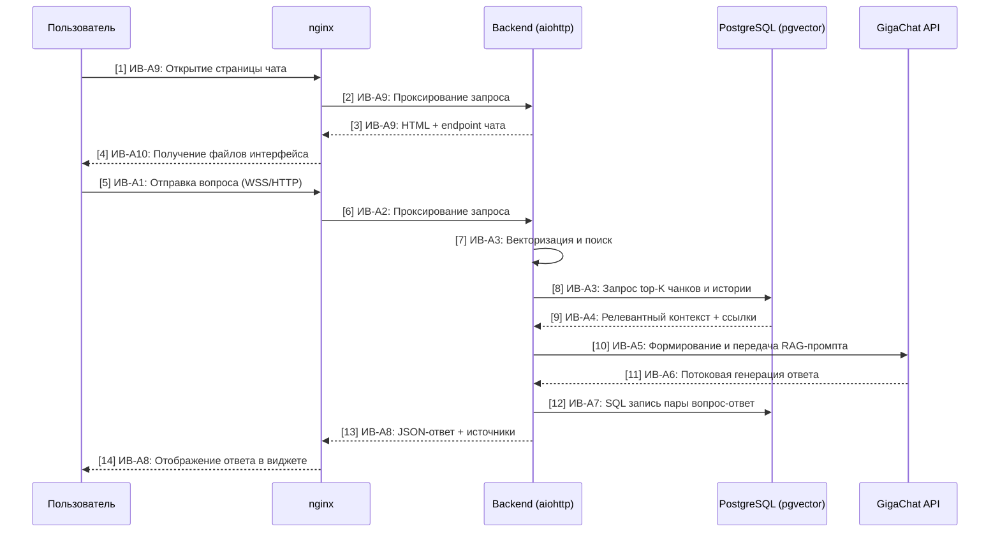
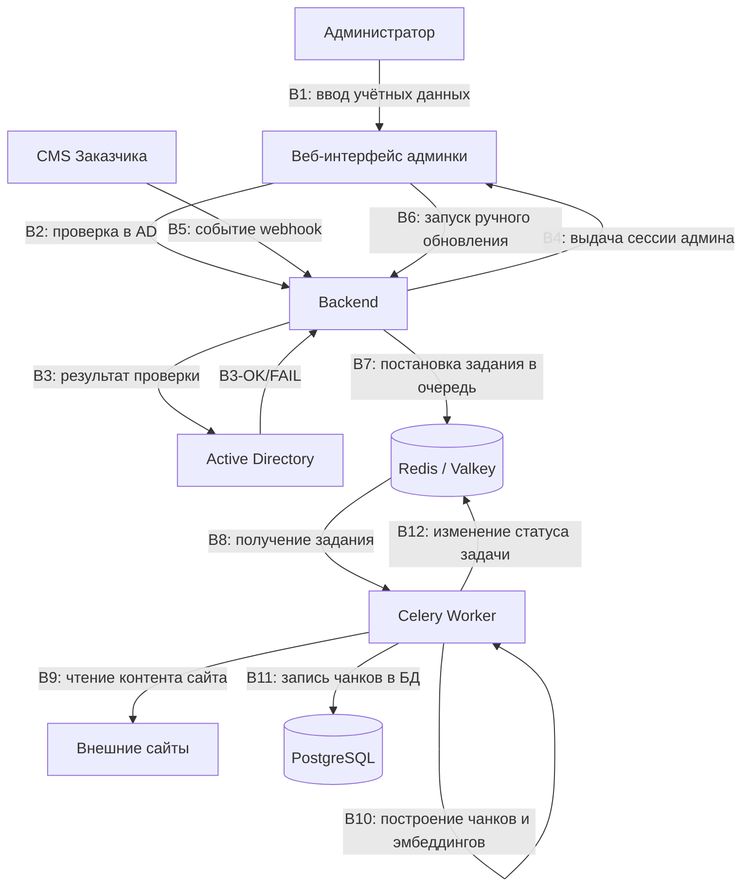
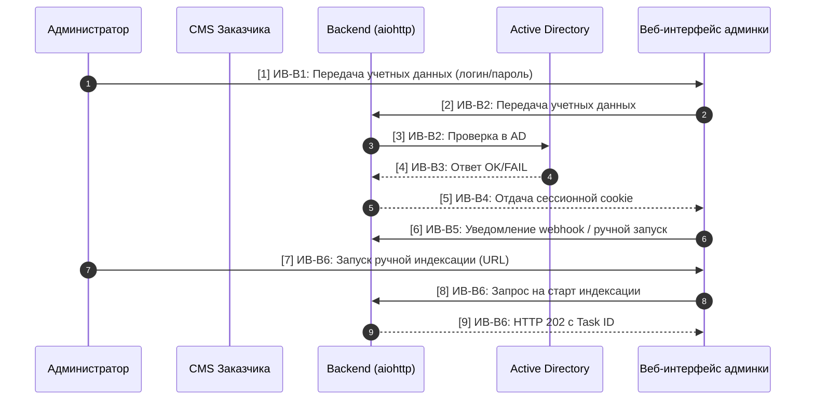
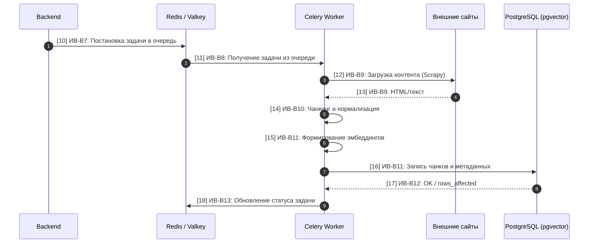
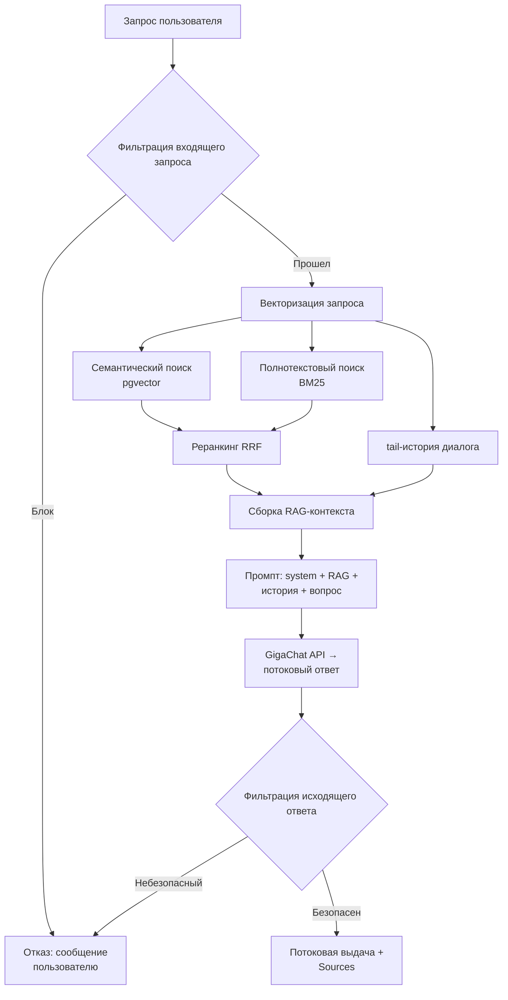
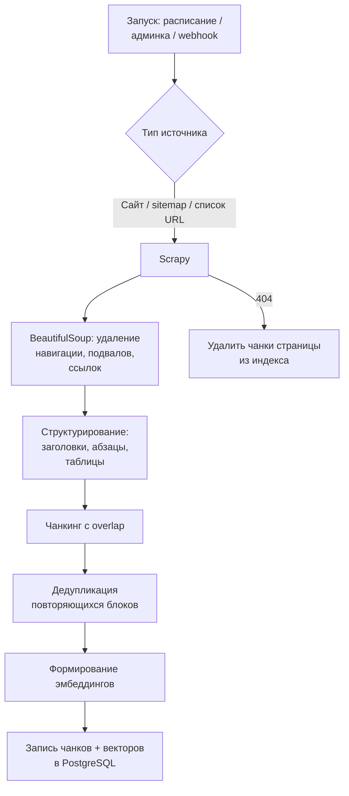

# АРХИТЕКТУРНАЯ СХЕМА И ПОЯСНИТЕЛЬНАЯ ЗАПИСКА

# 1. Введение и назначение системы

Настоящий документ описывает архитектуру веб-чат-бота, интегрированного в главную страницу портала АС «ВБУДУЩЕЕ». Сервис предназначен для обеспечения круглосуточной поддержки пользователей путем предоставления ответов на основе материалов Заказчика с использованием технологий RAG (Retrieval-Augmented Generation) и GigaChat API.

## 1.1 Ключевые цели

- Автоматизация ответов по внутренним материалам (Word, PDF и др.) с обязательным цитированием источников.

- Бесшовная интеграция с порталом Вбудущее.ру.

- Обеспечение высокой производительности: 1000+ одновременных открытых сессий.

- Соблюдение строгих требований кибербезопасности и SSDLC.

# 2. C4 Model: Уровень 1 — System Context

Описывает взаимодействие сервиса чат-бота с экосистемой АС «ВБУДУЩЕЕ» и внешним ИИ-провайдером.

*Рисунок 1. C4 Level 1 — System Context*

Легенда (System Context):

- Пользователь: инициирует чат через виджет.

- Портал ВБУДУЩЕЕ.ру: содержит JS-виджет и маршрутизирует пользователя на endpointы публичного nginx.

- VChat.Widget: компонент интерфейса встраиваемого чата на стороне клиента.

- Backend: единый backend на aiohttp, принимает трафик с виджета и админки, применяет политику безопасного диалога и оркестрирует все сценарии.

- Backend + Celery Worker: выполняют RAG-процессы и пайплайн индексации, включая подготовку векторов и запись чанков.

- PostgreSQL + pgvector (Vector Store): хранит векторные эмбеддинги чанков, историю диалогов и служебные справочники.

- Redis / Valkey: брокер очереди для задач индексации.

- Active Directory: источник для аутентификации и авторизации администраторов.

- Внешние источники: CMS и публичные сайты, на которых формируется источник знаний.

# 3. C4 Model: Уровень 2 — Containers

Раздел показывает компоненты сервиса VChat и потоки данных в двух основных сценариях. Диаграмма 3.1 — инвентаризация контейнеров без стрелок. Диаграммы 3.2 и 3.3 описывают потоки данных в каждом сценарии отдельно: запрос пользователя и индексация контента.

## 3.1 Инвентаризация контейнеров

*Рисунок 2.* *C4 Level 2* *— Инвентаризация контейнеров*

Краткое назначение контейнеров:

- nginx — раздача статики виджета (widget.js) и админки; reverse proxy для WebSocket/HTTP от виджета к Backend; терминация TLS.

- Backend — Python/aiohttp. Обрабатывает WebSocket от виджета, REST-запросы админки и входящие уведомления от внешних систем через авторизованные каналы из `02_openapi_specification`. Оркестрирует RAG-процессы и сессии.

- Celery Worker — Python/Celery. Объединяет краулер и индексатор: обход сайтов (Scrapy), извлечение и нормализацию контента, чанкинг, построение эмбеддингов, запись в PostgreSQL. Для индексации работает через Redis.

- Эмбеддинг не выделен в отдельный сервис: вычисление векторов выполняется внутри процесса Celery Worker в рамках индексации.

- Redis / Valkey — брокер очереди задач Celery. Используется только в сценарии индексации; запросы пользователей через очередь не проходят.

- PostgreSQL + pgvector — единый инстанс. Разграничение доступа на уровне ролей: Backend читает/пишет таблицы диалогов; Celery Worker пишет таблицы чанков и источников, а также статус выполнения.

## 3.2 Сценарий A — Запрос пользователя в чат-бот

Поток данных при обращении пользователя к ИИ-агенту через виджет.

*Рисунок 3. C4 Level 2 — Инвентаризация контейнеров*

***Таблица взаимодействий (Сценарий A):***

| №      | Направление (источник → приемник)    | Протокол / безопасность                  | Описание                                                                                         |
| ------ | ------------------------------------ | ---------------------------------------- | ------------------------------------------------------------------------------------------------ |
| ИВ-A1  | Пользователь (браузер) → nginx       | HTTPS/WSS, TLS 1.2+                      | Запрос виджета/открытие/инициализация чата Данные: widget.js, текст вопроса                   |
| ИВ-A2  | nginx → Backend                      | HTTP/WSS, внутренняя зона                | Проксирование вызова к backend Данные: Текст вопроса, `session_id`                            |
| ИВ-A3  | Backend → PostgreSQL                 | Внутренняя БД-связь, роль backend_reader | Поиск релевантного контекста по векторному индексу и истории Данные: SQL-запрос, top-K чанков |
| ИВ-A4  | PostgreSQL → Backend                 | Внутренняя БД-связь, роль backend_reader | Возврат релевантных фрагментов и метаданных Данные: Текст фрагментов, источники               |
| ИВ-A5  | Backend → GigaChat API               | HTTPS, TLS 1.2+ + API-ключ               | Отправка RAG-промпта Данные: Промпт                                                           |
| ИВ-A6  | GigaChat API → Backend               | HTTPS, TLS 1.2+ + API-ключ               | Возврат ответа и метаданных источников Данные: Текст ответа, refs                             |
| ИВ-A7  | Backend → PostgreSQL                 | Внутренняя БД-связь, роль backend_writer | Запись пары «вопрос-ответ» в историю диалога Данные: session_id, вопрос, ответ                |
| ИВ-A8  | Backend → Пользователь (через nginx) | WSS/HTTPS, TLS 1.2+                      | Потоковая выдача ответа и списка источников Данные: Текст ответа, links                       |
| ИВ-A9  | Backend → nginx                      | HTTP, внутренняя зона                    | Передача HTML-ответа и endpoint чата Данные: GET `/chat/widget/{code}`, `/widget/{code}`      |
| ИВ-A10 | nginx → Пользователь                 | HTTPS, TLS 1.2+                          | Отдача статических файлов интерфейса Данные: `/static/*`                                      |

*Redis в этом сценарии не используется — он задействован только при индексации контента (Сценарий B).*

*Рисунок 4. Sequence Diagram (Сценарий A) — Детализацию процесса обработки сообщения*

## 3.3 Сценарий B — Индексация контента

Поток данных при наполнении базы знаний. Включает два пути запуска: вручную через админку (с предварительной аутентификацией в AD) и автоматически по webhook от CMS Заказчика.

*Рисунок 5. Сценарий B — поток индексации контента*

**Таблица взаимодействий (Сценарий B):**

| №      | Направление (источник → приемник)        | Протокол / безопасность                     | Описание                                                                                                           |
| ------ | ---------------------------------------- | ------------------------------------------- | ------------------------------------------------------------------------------------------------------------------ |
| ИВ-B1  | Веб-интерфейс админки → Backend          | HTTPS, TLS                                  | Передача учетных данных администратора для проверки Данные: Логин, пароль                                       |
| ИВ-B2  | Backend → Active Directory               | LDAP/TLS, сервисный пользователь            | Проверка учетных данных в AD Данные: DN, пароль; ответ OK/FAIL                                                  |
| ИВ-B3  | Active Directory → Backend               | LDAP/TLS, TLS                               | Возврат решения по аутентификации Данные: OK/FAIL, dn                                                           |
| ИВ-B4  | Backend → Веб-интерфейс админки          | HTTPS, сессионный токен                     | Создание сессионного контекста после успешной проверки Данные: `session_token`                                  |
| ИВ-B5  | CMS Заказчика → Backend                  | HTTPS, см. 02_openapi_specification         | Уведомление об изменении источника Данные: См. 02_openapi_specification                                         |
| ИВ-B6  | Веб-интерфейс админки → Backend          | HTTPS, сессионная авторизация               | Запуск ручной индексации по URL Данные: source ids                                                              |
| ИВ-B7  | Backend → Redis / Valkey                 | Внутренняя БД-связь, внутренняя сеть        | Постановка задачи индексации в очередь Celery Данные: task_payload                                              |
| ИВ-B8  | Redis → Celery Worker                    | Redis, внутренняя сеть                      | Получение задачи воркером Данные: task_payload                                                                  |
| ИВ-B9  | Celery Worker → Внешние сайты            | HTTPS, внутренний доступ к внешним ресурсам | Сканирование и загрузка контента Данные: HTML/текст                                                             |
| ИВ-B10 | Celery Worker → Celery Worker            | Внутренняя логика                           | Чанкинг, нормализация и подготовка эмбеддингов Данные: Список чанков                                            |
| ИВ-B11 | Celery Worker → PostgreSQL               | Внутренняя БД-связь, роль worker_writer     | Запись чанков, векторов, метаданных источника Данные: INSERT в chunks, sources                                  |
| ИВ-B12 | Celery Worker → PostgreSQL               | Внутренняя БД-связь, роль worker_writer     | Подтверждение записи чанков и метаданных Данные: OK/rows_affected                                               |
| ИВ-B13 | Celery Worker → Redis / Valkey           | Redis, внутренняя сеть                      | Обновление статуса обработки задачи Данные: SUCCESS/FAILED                                                      |
| ИВ-B14 | Backend → Админка (веб-страницы)         | HTTPS, TLS                                  | Отдача HTML страницы админки и ссылок на ресурсы Данные: `/users`, `/source`, `/stats`, `/chat`                 |
| ИВ-B15 | Backend / Nginx → Браузер администратора | HTTPS, TLS                                  | Отдача ассетов админки и чата (CSS/JS/иконки) Данные: `/static/assets/*`, `/static/chat/*`, `/static/favicon.*` |

*Рисунок 6.1. Сценарий B — постановка задачи индексации*

*Рисунок 6.2. Сценарий B — обработка в очереди и запись результатов*

Описание этапов Сценария B:

- Разделение ответственности: Backend не дожидается завершения индексации. После проверки админа и авторизации задачи только ставятся в очередь Redis (ИВ-B7), а HTTP-ответ 202 сразу возвращается администратору (ИВ-B6), что обеспечивает отзывчивость админки.

- Взаимодействие между HTTP-слоем (Backend/админка) и `Celery Worker` реализовано через Redis/Valkey: Backend только кладет задание в очередь (ИВ-B7), далее воркер забирает его из очереди (ИВ-B8) и после обработки обновляет статус (ИВ-B13).

- Работа Celery Worker: Воркер берёт задачу из очереди (ИВ-B8) и обрабатывает источники из CMS/ручного запуска: сканирование веб-страниц и разбор контента, формирование чанков и векторов (ИВ-B9/ИВ-B10).

- Векторизация и запись: Чанки обрабатываются в рамках worker-процесса и сразу записываются в PostgreSQL с метаданными (ИВ-B11/ИВ-B12).

- Атомарная запись: Результат обработки записывается в PostgreSQL (ИВ-B12). После завершения статуса задачи обновляются в Redis (ИВ-B13), затем данные становятся доступны для сценария A.

# 4. C4 Model: Уровень 3 — Логика Backend (RAG-конвейер)

Детализация внутренней логики Backend при обработке пользовательского запроса (Сценарий A) в части RAG.

*Рисунок 7. Логика Backend — RAG-конвейер*

Критерии блокировки (подробнее см. 05_security_policies.md):

- До запроса к GigaChat: prompt injection, токсичный контент, запрос вне тематики сервиса.

- После ответа GigaChat: обнаружение ПДн РФ (локальные регулярные выражения), фильтрация внешних URL (разрешен только whitelist), проверка на NSFW и повторный контроль Prompt Injection в тексте ответа. Точность ответа гарантируется на этапе извлечения данных методом Reciprocal Rank Fusion (RRF), что исключает использование не релевантного контекста.

# 5. C4 Model: Уровень 3 — Логика Celery Worker (индексация)

Детализация внутренней логики Celery Worker при обработке задач индексации (Сценарий B).

*Рисунок 8. Логика Celery Worker — индексация*

# 6. Технологические и эксплуатационные требования

## 6.1 Стек технологий

- **Язык:** Python 3.

- **Web-фреймворк:** aiohttp.

- **LLM:** GigaChat API (версия MAX и выше) — только генерация ответов.

- **Embedding модель:** внутренний механизм вычисления векторных представлений, self-hosted, CPU.

- **Парсинг контента:** библиотеки для обработки HTML/документов по URL с финальным преобразованием в markdown-представление, python-docx, pdfplumber, python-pptx.

- **Парсинг HTML:** Scrapy, с финальным преобразованием в текстовый формат.

- **База данных:** PostgreSQL + расширение pgvector.

- **Очередь задач:** Redis / Valkey + Celery.

- **Веб-сервер / proxy:** nginx — раздача статики, reverse proxy, терминация TLS.

- **Аутентификация админки:** LDAP (python-ldap) → Active Directory Заказчика.

- **Контейнеризация:** Docker.

- **CI/CD и контроль качества:** GitLab CI выполняет тесты и качество кода (ruff, bandit). В репозитории дополнительно используется расширенная модель оценки безопасности через `security-check` (Semgrep, Gitleaks, OSV, Trivy, Syft/SBOM + расширенный ruff-bandit контур).

- **Метрики:** prometheus_client — экспорт через /metrics. Выбор системы визуализации — на стороне Заказчика.

- **Логирование:** Структурированные JSON-логи в stdout.

## 6.2 Источники документов для базы знаний

Система поддерживает два способа пополнения базы знаний:

- **Краулинг веб-страниц:** автоматический обход сайтов по расписанию или вручную через механизм, описанный в документе 02_openapi_specification (входные параметры и требования к подписи/аутентификации там же). Стратегия приоритизации описана в документе 09_project_sites_indexing_strategy.md.

- **Интерфейс администратора:** запуск ручной индексации по URL источников, просмотр источников, статусов индексации и журналов. Доступ к админке — после аутентификации в корпоративном AD по LDAP.

Помимо этого интерфейс администратора позволяет просматривать и изменять: Источники, журнал индексации и событий, и системные настройки доступны через встроенный веб-интерфейс администратора. Доступ к интерфейсу осуществляется по логину и паролю. Пароли хранятся в БД в захэшированном виде (SHA-512 с солью). Доступ должен осуществляется через защищенное соединение HTTPS, с ограничениями средствами сетевой инфраструктуры Заказчика (VPN или выделенный домен с ограничением по IP).

## 6.3 Развертывание и масштабирование

CI/CD-конвейер на базе GitLab CI выполняет проверочный контур: тесты, линтинг и запуск базовых шагов валидации. Для полного безопасностного аудита предусмотрена отдельная модель оценки `security-check` (Semgrep/Gitleaks/OSV/Trivy/SBOM + ruff-bandit). Дальнейшая схема сборки и публикации изображений инфраструктуры описывается в эксплуатационных инструкциях отдельного контура развертывания.

Горизонтальное масштабирование обеспечивается stateless-архитектурой Backend и Celery Worker: возможен запуск произвольного числа реплик. Единственный stateful-компонент — PostgreSQL + pgvector. Через Redis / Valkey осуществляется управление очередью задач Celery.

## 6.4 Безопасность и надежность

- Защита от инъекций: валидация промптов и структурных фильтров до/после обращения к LLM.

- Изоляция сессий: разделение контекста и истории диалога между пользователями.

- Аутентификация админки: LDAP в корпоративном AD Заказчика.

- Аутентификация внешних вызовов (/api/update): см. 02_openapi_specification.

- SLA/SLO: время ответа менее 20 сек для 90-го процентиля при нагрузке 1 000+ одновременных сессий; целевая доступность 99%.

- Подробные политики безопасности — в документе 05_security_policies.
