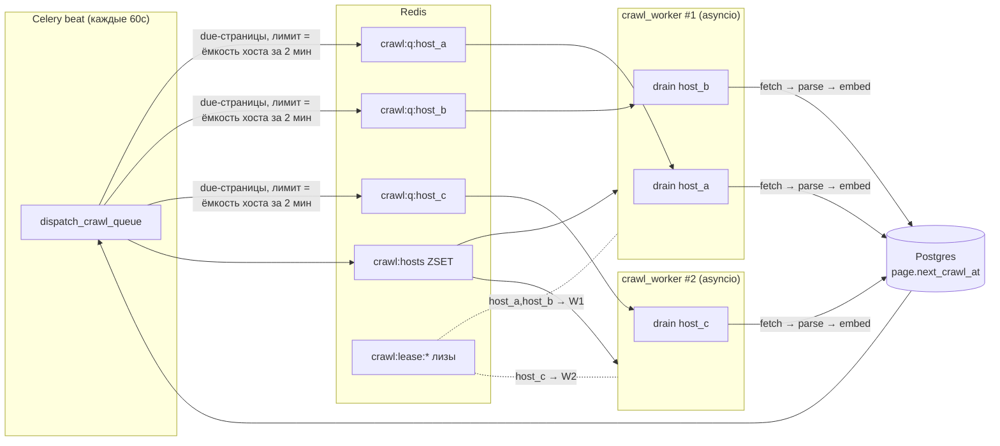
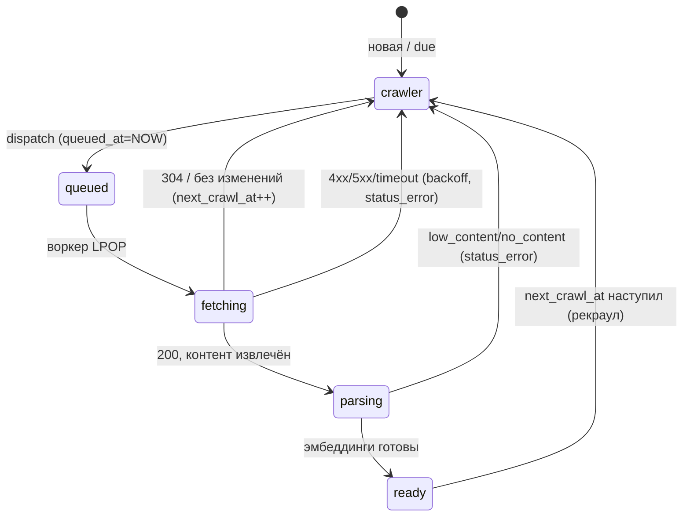

# План: распределённый краулер на Celery без Scrapy-паука

Статус: черновик для обсуждения
Заменяет: cron-реиндексацию и непрерывного Scrapy-паука (`ContinuousSpider`)
Связано с: `docs/crawling-reindex-plan.md` (модели, корзины, hub, adaptive interval — остаются в силе)

---

## 1. Цель и мотивация

Сейчас скачивание сделано через Scrapy: либо `crawl_page_task` запускает `crawler_runner` подпроцессом на одну страницу, либо `ContinuousSpider` крутится непрерывно и опрашивает БД только когда **очередь Scrapy пуста** (`spider_idle`). Оба варианта плохи:

- **Scrapy-движок нам нужен на 20%.** Мы используем его как HTTP-загрузчик. Планировщик очереди, обход ссылок, дедуп, throttling — у нас уже есть своя логика в БД (`iter_priority_crawl_queue`, `check_interval_days`, корзины A/B/C). Движок Scrapy с этим конфликтует.
- **`ContinuousSpider` не видит изменений в БД при полной очереди.** При 7000 страниц в очереди `spider_idle` не сработает часами — новые страницы из sitemap-sync он не подхватит.
- **Не масштабируется горизонтально.** Один процесс-паук = один поток обработки. Чтобы расти до тысяч сайтов, нужно уметь добавлять воркеры.

**Чего хотим:**

1. Управление через **Celery** — чтобы добавлять воркеры на разных машинах и расти до тысяч источников.
2. **Асинхронное скачивание** (aiohttp): один воркер качает много хостов параллельно (≈10 одновременных запросов).
3. **Строгий пер-хостовый rate limit**: не больше `concurrent_requests` параллельно к одному серверу и не чаще `download_delay` между запросами — суммарно по всем воркерам.
4. **Никаких дублей**: два воркера не берут один URL.
5. **Непрерывность** в рамках лимитов: двигаемся по очереди без остановки, новые страницы подхватываем быстро.
6. **Backoff** для упавших страниц.
7. Когда очередь иссякла — периодически проверяем БД и засыпаем.

---

## 2. Ключевая идея: rate limit пер-хост ⇒ хост-шардинг

Лимит скорости привязан к **хосту** (серверу), а не к URL. Отсюда вывод:

> Двум воркерам качать один хост **бессмысленно** — суммарно они всё равно ограничены `concurrency`/`delay` этого хоста. Значит закрепляем каждый хост за **одним** воркером в каждый момент времени.

Это закрепление (Redis-лиз `crawl:lease:{host}`) превращает сложную задачу «распределённый rate limit между N воркерами» в тривиальную «локальный rate limit внутри одного процесса»:

- параллелизм хоста → `asyncio.Semaphore(concurrency)` внутри воркера-владельца;
- задержка хоста → один монотонный таймштамп `next_allowed_start` под `asyncio.Lock`.

Никаких Lua-token-bucket'ов, никаких гонок между воркерами, точное соблюдение лимита by construction.

При этом **пропускная способность не теряется**: хост с `concurrency=1, delay=3` физически отдаёт ≤20 стр/мин — хоть одним воркером, хоть десятью. Шардинг по хостам ничего не отнимает у rate-limited хостов; он лишь означает, что мы не дробим один хост между воркерами (что и не нужно). Несколько воркеров дают параллелизм **по разным хостам** — ровно то, что нужно при тысячах сайтов.



---

## 3. Что оставляем, что выкидываем

### 3.1. Переиспользуем из текущего кода (без изменений логики)

Вся «обработка» уже написана и работает — её надо лишь **отвязать от Scrapy** (вынуть из `DatabasePipeline.process_item` и из спайдера в обычные функции):

| Что | Где сейчас | Куда переезжает |
|---|---|---|
| Извлечение текста (HTML→markdown, boilerplate, word_count) | `extract_url_document()` | вызывается как есть на стадии parse |
| Весь конвейер сохранения страницы | `DatabasePipeline.process_item` | → функция `process_fetched_page(item)` (без `self`, без `spider`) |
| Auth-редиректы | `is_auth_redirect()` | как есть |
| 4xx / 5xx обработка | `handle_error_page`, `save_page_status` | как есть |
| no_content / low_content | `is_low_content_page` | как есть |
| Hub-детект | `count_internal_links` + порог | как есть |
| Adaptive interval | `compute_adaptive_interval` | как есть (+ пишет `next_crawl_at`) |
| Граф ссылок | `sync_page_links` | как есть |
| Постановка эмбеддинга | `schedule_index_document(page.id)` | как есть |
| Приоритетная очередь / корзины A/B/C | `iter_priority_crawl_queue`, `iter_all_sources_queue` | используется диспетчером |
| Извлечение исходящих ссылок | `LinkExtractor` в спайдере | → функция `extract_out_links(html, base_url, tracked_hosts, rules)` |
| Sitemap-sync, reprioritize, maintenance | `tasks.py` | как есть |
| Конфиг лимитов | `SourceConfig.crawler_*` | как есть |

### 3.2. Выкидываем

- `jobs/crawler/spiders/continuous.py`, `general.py`, `list.py` — спайдеры.
- `jobs/crawler/continuous_runner.py`, `crawler_runner.py` — раннеры Scrapy-процессов.
- `jobs/crawler/settings.py` — настройки Scrapy (CONCURRENT_REQUESTS, DOWNLOAD_DELAY и т.д. теперь применяются нами).
- `crawl_page_task` (подпроцесс на одну страницу) — заменяется конвейером диспетчер→воркер.
- Зависимость `scrapy` целиком — **на финальной фазе**. Сначала можно оставить `scrapy.linkextractors.LinkExtractor` как библиотеку (он работает standalone), потом заменить на lxml и убрать пакет.

### 3.3. Что из Scrapy реально берём

Только `LinkExtractor` (извлечение `<a href>` с резолвом относительных URL) — и то временно. Сам HTTP-загрузчик, движок, планировщик, throttle — не берём, у нас своё.

---

## 4. Архитектура: три стадии

```
[crawler] страница due
      │  dispatch_crawl_queue (beat, 60с)        → ставит в Redis per-host очередь, queued_at=NOW()
      ▼
   FETCH (aiohttp, async, voркер-владелец хоста)  → HTTP GET с лимитами хоста
      │  → item {url, final_url, http_status, etag, html, content_type, title}
      ▼
   PARSE (CPU)                                     → process_fetched_page(item): extract → upsert Page → status=parsing
      │  → schedule_index_document(page_id)
      ▼
   EMBED (очередь embeddings, как сейчас)          → index_document → chunks → status=ready
```

FETCH — I/O-bound, асинхронный. PARSE — CPU-bound. EMBED — уже отдельная очередь. Разделение даёт независимое масштабирование (см. §10 «открытый вопрос: parse inline vs celery-handoff»).

### 4.1. Компонент: диспетчер `dispatch_crawl_queue_task`

Celery-beat-задача, **каждые 60 секунд**. Единственная точка, которая ходит в БД за расписанием. Наполняет per-host очереди в Redis ровно настолько, насколько хост успеет выгрести за окно упреждения (≈2 минуты), и не больше.

Псевдокод:

```python
LOOKAHEAD_SECONDS = 120
MIN_SPACING = 0.2          # нижняя граница, чтобы delay=0 не дал бесконечную ёмкость
MAX_QUEUE_PER_HOST = 200   # потолок для хостов с delay=0

def dispatch_crawl_queue():
    for source in active_sources():           # is_paused = false
        host = host_of(source.uri)
        cfg = source.config                    # concurrency, delay, timeout
        spacing = max(cfg.download_delay, MIN_SPACING)
        capacity = min(MAX_QUEUE_PER_HOST,
                       ceil(LOOKAHEAD_SECONDS / spacing) * cfg.concurrent_requests)
        depth = redis.llen(f"crawl:q:{host}")
        need = capacity - depth
        if need <= 0:
            register_host(host, cfg)           # ZADD crawl:hosts
            continue

        rows = select_due_pages(source.id, limit=need)   # см. §6, порядок = корзины A/B/C
        if not rows:
            continue

        mark_queued(rows.ids)                  # UPDATE page SET queued_at=NOW() WHERE id IN (...)
        redis.rpush(f"crawl:q:{host}", *payloads(rows))
        register_host(host, cfg)
```

Важное уточнение к твоей формулировке «забить на 2 минуты вперёд с учётом числа воркеров»: **глубина очереди хоста определяется скоростью самого хоста, а не числом воркеров.** Воркеры влияют не на глубину per-host очереди, а на то, **сколько хостов** обрабатывается параллельно. Поэтому диспетчер наполняет очередь до 2-минутной ёмкости хоста, а число воркеров — отдельный рычаг (§10).

`mark_queued` + проверка `queued_at` в `select_due_pages` — это аналог `SELECT … FOR UPDATE SKIP LOCKED` на уровне диспетчеризации: страница, уже лежащая в Redis-очереди или в работе, повторно не выдаётся. Протухший `queued_at` (старше TTL лиза) снова становится eligible — самовосстановление после падений.

### 4.2. Компонент: воркер `crawl_worker_task`

Celery-задача, внутри запускает `asyncio.run(run_worker(deadline))`. Живёт ≈10 минут, потом грейсфул-выход и перезапуск (§7). Берёт во владение хосты, у которых есть работа и нет живого лиза, и параллельно их выгребает.

```python
GLOBAL_CONCURRENCY   = 10   # суммарно одновременных запросов на воркер (aiohttp connector limit)
MAX_HOSTS_PER_WORKER = 50   # сколько хостов один воркер тянет одновременно
WORKER_TTL           = 600  # 10 минут
GRACE                = 60   # хвост: дотягиваем in-flight, новое не берём

async def run_worker(worker_id, deadline):
    connector = aiohttp.TCPConnector(limit=GLOBAL_CONCURRENCY)
    async with aiohttp.ClientSession(connector=connector) as session:
        hosts = {}   # host -> asyncio.Task (drain_host)
        while now() < deadline - GRACE:
            for host, cfg in redis_hosts_with_work():
                if len(hosts) >= MAX_HOSTS_PER_WORKER:
                    break
                if host in hosts:
                    continue
                if acquire_host_lease(host, worker_id, ttl=WORKER_TTL):
                    hosts[host] = spawn(drain_host(session, worker_id, host, cfg, deadline))
            reap_finished(hosts)          # снять лиз с хостов, чья очередь иссякла
            await asyncio.sleep(1)
        # GRACE: новых хостов/страниц не берём, ждём текущие, отпускаем лизы
        await drain_in_flight(hosts)
        release_all(hosts, worker_id)
```

`drain_host` — здесь и живёт rate limit. Поскольку хост держит **один** воркер (лиз), локальных примитивов достаточно для точного глобального лимита:

```python
async def drain_host(session, worker_id, host, cfg, deadline):
    sem = asyncio.Semaphore(cfg.concurrent_requests)
    spacing_lock = asyncio.Lock()
    next_start = 0.0
    inflight = set()

    while now() < deadline - GRACE and lease_alive(host, worker_id):
        payload = redis.lpop(f"crawl:q:{host}")
        if payload is None:
            break                                  # очередь хоста пуста → выходим, лиз снимется
        await sem.acquire()
        async with spacing_lock:                   # выдержать delay между СТАРТАМИ запросов
            wait = max(0, next_start - monotonic())
            if wait: await asyncio.sleep(wait)
            next_start = monotonic() + cfg.download_delay
        t = spawn(fetch_and_process(session, payload, cfg, on_done=sem.release))
        inflight.add(t)
        renew_lease(host, worker_id, ttl=WORKER_TTL)
    await gather(inflight)
    release_lease(host, worker_id)
```

### 4.3. Компонент: `fetch_and_process`

```python
async def fetch_and_process(session, payload, cfg, on_done):
    try:
        resp = await session.get(payload.url,
                                 timeout=cfg.download_timeout,
                                 headers=conditional_headers(payload.last_etag),
                                 allow_redirects=True)
        body = await resp.text()
        if resp.status == 304:
            mark_unchanged(payload.page_id)        # bump last_crawled_at, next_crawl_at
            return
        item = build_item(payload, resp, body)
        # PARSE: CPU-bound — НЕ в event loop (см. §10)
        await run_in_executor(process_fetched_page, item)   # либо → celery parse_page_task
    except (asyncio.TimeoutError, aiohttp.ClientError) as exc:
        apply_backoff(payload.page_id, exc)        # error_count++, next_crawl_at=NOW()+backoff
    finally:
        clear_queued(payload.page_id)              # queued_at = NULL
        on_done()                                  # sem.release
```

`process_fetched_page(item)` — это `DatabasePipeline.process_item`, переписанный в обычную функцию: тот же auth/4xx/5xx/extract/low_content/hub/adaptive/links/embed конвейер, ровно как сейчас.

---

## 5. Структуры данных в Redis

| Ключ | Тип | Назначение | TTL |
|---|---|---|---|
| `crawl:q:{host}` | LIST | очередь готовых к скачиванию payload'ов хоста (RPUSH диспетчер, LPOP воркер) | — (пуст ⇒ нет работы) |
| `crawl:hosts` | ZSET | хосты, у которых есть работа; score = приоритет/время; хранит cfg | — |
| `crawl:lease:{host}` | STRING | владелец хоста: `worker_id`, `SET NX EX WORKER_TTL` | WORKER_TTL |
| `crawl:inflight:count` | STRING | счётчик активных воркер-слотов (для супервизора) | — |

`payload` = компактный JSON: `{page_id, url, source_id, last_etag, rules_ref}`. Правила источника большие — кладём не сами правила, а ссылку/версию; воркер берёт правила из кэша конфигов (обновляется раз в минуту).

Лиз через `SET NX EX` решает «никаких дублей по хостам». LPOP атомарен → «никаких дублей по URL» даже если бы лиз протёк.

---

## 6. Модель данных: что добавить

Текущий due-запрос (`iter_all_sources_queue`) считает `last_crawled_at + check_interval_days*interval <= NOW()` в WHERE — это **seq scan + sort по всей таблице page** каждые 60 секунд. На тысячах сайтов и миллионах страниц не взлетит.

**Добавить в `page`:**

```sql
ALTER TABLE page ADD COLUMN next_crawl_at  timestamptz NULL;   -- материализованное расписание
ALTER TABLE page ADD COLUMN queued_at      timestamptz NULL;   -- «в очереди/в работе» (анти-дубль)

-- частичный индекс: только то, что вообще можно кр474лить
CREATE INDEX ix_page_due ON page (next_crawl_at)
  WHERE status = 'crawler' AND queued_at IS NULL
    AND (status_error IS NULL OR status_error = 'http_5xx');
```

`next_crawl_at` пишется везде, где сейчас пишется `check_interval_days`:
- `compute_adaptive_interval` → `next_crawl_at = last_crawled_at + interval`;
- sitemap-sync (`check_interval_days=1`) → `next_crawl_at = NOW()`;
- `reprioritize_source_task` → `next_crawl_at = NOW()`;
- backoff → `next_crawl_at = NOW() + backoff(error_count)`;
- новая страница (никогда не краулилась) → `next_crawl_at = NOW()`.

`select_due_pages` становится индексным:

```sql
SELECT id, uri, source_id, last_etag FROM page
WHERE source_id = :sid AND status = 'crawler' AND queued_at IS NULL
  AND (status_error IS NULL OR status_error = 'http_5xx')
  AND next_crawl_at <= NOW()
ORDER BY  is_hub_page DESC,            -- корзина A
          (status_error = 'http_5xx'), -- корзина C в конец
          next_crawl_at ASC            -- самые просроченные первыми
LIMIT :need;
```

Логику корзин A/B/C из `iter_priority_crawl_queue` сохраняем — переносим в этот ORDER BY / в несколько под-выборок.

> v1-упрощение: можно временно оставить существующий `iter_all_sources_queue` без `next_crawl_at` (работает корректно, просто медленнее) и добавить индексную колонку отдельной фазой. Но для заявленной цели «тысячи сайтов» колонка обязательна.

### Жизненный цикл страницы



(`queued`/`fetching` — это не значения enum, а `queued_at IS NOT NULL`; enum остаётся crawler/parsing/ready.)

---

## 7. Жизненный цикл воркера: 10 минут + grace

Требование: воркеры работают ~10 минут и перезапускаются; в grace-период дотягивают хвосты и не берут новое.

- `crawl_worker_task` считает `deadline = now + WORKER_TTL`. Основной цикл — до `deadline - GRACE`. Потом grace: не берём новые хосты/страницы, ждём in-flight, отпускаем лизы, выходим.
- Зачем перезапуск: сброс памяти/утечек, перебалансировка хостов между воркерами, подхват изменений конфига.
- **Супервизор** (beat-задача `supervise_crawl_workers`, каждую минуту) держит `desired_worker_slots` задач в полёте: смотрит `crawl:inflight:count`, доливает недостающие `crawl_worker_task` в очередь `crawl`. Celery с `prefetch=1`, `acks_late=true`, `max_tasks_per_child=1` даёт скользящий перезапуск: задача отжила 10 мин → слот освободился → супервизор долил.
- Лиз с TTL=WORKER_TTL: если воркер умер, лиз протухнет ≤10 мин, хост подхватит другой. `queued_at` протухших страниц тоже снова станет eligible.

---

## 8. Семантика лимитов (включая спорный случай delay=0)

Фиксируем определения, чтобы не было разночтений:

- **`crawler_concurrent_requests`** — максимум одновременно «в полёте» запросов к хосту. Реализация: `asyncio.Semaphore(N)` у владельца хоста.
- **`crawler_download_delay`** — минимальный интервал между **стартами** двух последовательных запросов к хосту. Реализация: `next_allowed_start` под `asyncio.Lock`.
- **`crawler_download_timeout`** — таймаут одного запроса (aiohttp `ClientTimeout`).

Случаи:
| Хост | concurrency | delay | Поведение |
|---|---|---|---|
| a | 1 | 1с | строго по одному, старт не чаще раза в секунду |
| b | 2 | 0 | до 2 в полёте, без интервала между стартами |
| c | 1 | 3с | по одному, не чаще раза в 3с |

Случай b (delay=0, concurrency=2) корректен: семафор держит ≤2 в полёте, `next_allowed_start` не вносит задержки. Глубину очереди для таких хостов ограничиваем `MAX_QUEUE_PER_HOST` (иначе ёмкость «за 2 минуты» формально бесконечна).

Адаптация под 429/rate-limit (текущая логика «3 подряд rate-limited run → удвоить delay») переносится на уровень хоста: при серии 429 временно поднимаем эффективный `download_delay` хоста в Redis (`crawl:hosts` score/мета), сбрасываем при норме.

---

## 9. Как краулер узнаёт об изменениях в БД (ответ на исходный вопрос)

**Единственная точка интеграции — диспетчер, опрос раз в 60 секунд.** Никаких сигналов/шины событий не нужно:

- любой, кто меняет расписание (`sitemap_sync_task`, `reprioritize_source_task`, ручной рекраул, создание источника, добавление страниц), просто выставляет `next_crawl_at = NOW()` (или раньше);
- следующий тик диспетчера (≤60с) индексным запросом `next_crawl_at <= NOW()` видит эти страницы и кладёт в Redis-очередь;
- воркеры забирают из Redis в реальном времени.

Дёшево, потому что это **индексный** запрос по `ix_page_due`, а не скан таблицы. При желании — быстрый `EXISTS`-гард: если ничего не due, диспетчер не делает ничего. Когда очередь иссякла, хосты выгребаются, лизы снимаются, воркеры засыпают/рециклятся, супервизор держит минимум слотов «на дежурстве». Появились due-страницы → подхват за ≤60с.

---

## 10. Масштабирование до тысяч сайтов

- **Диспетчер** O(число источников) на тик, due-выборка индексная. Тысячи источников — это тысячи коротких `LIMIT need` запросов; при необходимости группируем и/или шардируем диспетчер по диапазону `source_id`.
- **Хосты партиционируются лизами** между любым числом воркеров: добавил воркер → он разбирает свободные хосты. Линейный рост по хостам.
- **Узкое место — parse (CPU), не fetch.** Здесь развилка:

  **Открытый вопрос A — где парсить:**
  - *(A1) inline через `run_in_executor`* — просто, без передачи HTML по сети; парсинг крутится в thread-pool воркера, не блокируя event loop. Хорошо для v1.
  - *(A2) handoff в Celery* — воркер только качает, кладёт сырой HTML (в `page.content` / temp) и шлёт `parse_page_task` в отдельную CPU-очередь. Чистое разделение fetch/parse, независимое масштабирование, но HTML гоняется через БД/Redis. Рекомендую как целевой вариант при росте.

  Предлагаю v1 = A1, заложить интерфейс так, чтобы переключение на A2 было локальным.

---

## 11. Конфигурация

**`project_config` (глобально, новые ключи):**
| Ключ | Дефолт | Смысл |
|---|---|---|
| `crawl_global_concurrency` | 10 | одновременных запросов на воркер |
| `crawl_max_hosts_per_worker` | 50 | хостов на воркер одновременно |
| `crawl_worker_ttl` | 600 | жизнь воркера, с |
| `crawl_worker_grace` | 60 | grace-хвост, с |
| `crawl_lookahead_seconds` | 120 | горизонт наполнения очереди |
| `crawl_desired_worker_slots` | 1 | сколько воркер-слотов держать (рычаг масштаба) |
| `crawl_max_queue_per_host` | 200 | потолок очереди для delay=0 |

**`SourceConfig` (пер-источник, уже есть):** `crawler_concurrent_requests` (1), `crawler_download_delay` (3), `crawler_download_timeout` (30). `crawler_max_pages` становится не нужен (бюджета нет) — депрекейтим.

---

## 12. Backoff упавших страниц

```python
BACKOFF_BASE = 300      # 5 мин
BACKOFF_CAP  = 86400    # 1 сутки

def apply_backoff(page_id, exc):
    error_count += 1
    delay = min(BACKOFF_CAP, BACKOFF_BASE * 2 ** (error_count - 1))
    next_crawl_at = NOW() + delay
    # сетевые ошибки/timeout → отдельный retriable-маркер (как http_5xx),
    # чтобы due-запрос их подхватывал, но не сразу
```

4xx уже уводит интервал в 90 дней (`handle_error_page`) — сохраняем. 5xx остаётся retriable (попадает в корзину C).

---

## 13. План реализации по фазам

### Фаза 0 — отвязать обработку от Scrapy (без смены поведения)
- [ ] Вынести `DatabasePipeline.process_item` → функция `process_fetched_page(item: dict)` (тот же конвейер, `logging` вместо `spider.logger`, `engine` создаётся внутри).
- [ ] Вынести извлечение ссылок спайдера → `extract_out_links(html, base_url, tracked_hosts, rules)`.
- [ ] Юнит-тест обеих функций на сохранённом HTML-фикстуре (сравнить с текущим выводом пайплайна).

### Фаза 1 — схема расписания
- [ ] Миграция: `page.next_crawl_at`, `page.queued_at`, частичный индекс `ix_page_due`.
- [ ] Бэкфилл `next_crawl_at = COALESCE(last_crawled_at + check_interval_days*interval, NOW())`.
- [ ] Писать `next_crawl_at` во всех точках, где пишется `check_interval_days` (pipeline, sitemap-sync, reprioritize).

### Фаза 2 — диспетчер
- [ ] `dispatch_crawl_queue_task` + Redis per-host очереди + `crawl:hosts`.
- [ ] `select_due_pages` (индексный, с корзинами A/B/C).
- [ ] `mark_queued` / `clear_queued`.
- [ ] Beat: `dispatch_crawl_queue` каждые 60с. (Снять старый `ContinuousSpider`.)

### Фаза 3 — асинхронный воркер
- [ ] `crawl_worker_task` → `run_worker` (aiohttp, лизы, `drain_host`, `fetch_and_process`).
- [ ] Лизы `crawl:lease:{host}` (SET NX EX + renew).
- [ ] Rate limit: `Semaphore` + `next_allowed_start`.
- [ ] Parse через `run_in_executor` (вариант A1).
- [ ] Backoff упавших.
- [ ] 10-мин рецикл + grace; `supervise_crawl_workers` beat-задача; очередь `crawl`.
- [ ] `make crawler` → запуск celery-воркера на очередь `crawl` (по образцу `make embedder`).

### Фаза 4 — снос Scrapy
- [ ] Удалить спайдеры, раннеры, `settings.py`, `crawl_page_task`, `ContinuousSpider`.
- [ ] Заменить `LinkExtractor` на lxml, убрать `scrapy` из requirements.
- [ ] Решить судьбу `CrawlRun` (репурпоз под пер-хост метрики или удаление).

### Фаза 5 — наблюдаемость
- [ ] Метрики: глубина `crawl:q:*`, in-flight, fetch rate/хост, карта лизов.
- [ ] Привязать к странице `/source` (счётчик «Ожидает» = COUNT due-страниц).

---

## 14. Покрытие текущих «потребностей обработки» (чек-лист, чтобы ничего не потерять)

| Потребность | Где в новой схеме |
|---|---|
| Приоритет (hub/due/5xx) | `select_due_pages` ORDER BY (корзины A/B/C) |
| Adaptive `check_interval_days` | `process_fetched_page` → пишет `next_crawl_at` |
| Auth-редиректы | `process_fetched_page` (как сейчас) |
| 4xx / 5xx / timeout | `fetch_and_process` + `process_fetched_page` + backoff |
| no_content / low_content | `process_fetched_page` |
| Hub-детект | `process_fetched_page` |
| Граф ссылок + новые страницы | `extract_out_links` → `sync_page_links` (создаёт placeholder Page с `next_crawl_at=NOW()`) |
| Sitemap-приоритет | `sitemap_sync_task` → `next_crawl_at=NOW()` |
| Boilerplate dedup | `rebuild_boilerplate_index` (maintenance, без изменений) |
| Эмбеддинги | `schedule_index_document` (без изменений) |
| Orphan cleanup / inlink counts | `run_maintenance_task` (без изменений) |
| Условные GET (ETag) | `conditional_headers` + ветка 304 |
| Rate-limit адаптация (429) | per-host эффективный delay в Redis |

---

## 15. Открытые вопросы для обсуждения

1. **Parse inline (A1) vs Celery-handoff (A2)** — §10. Предлагаю A1 для v1.
2. **`next_crawl_at` сразу или отложить** — §6. Предлагаю сразу (ради заявленной цели масштаба).
3. **Воркер как Celery-task с asyncio-циклом vs отдельный launcher** (как `jobs/embedder/launcher.py`), но под управлением Celery. Предлагаю Celery-task на выделенной очереди `crawl` + супервизор.
4. **delay=0 / concurrency>1 (хост b)** — §8: семантика «≤N в полёте, без интервала», глубина капается `MAX_QUEUE_PER_HOST`. Ок?
5. **Судьба `CrawlRun`** — сейчас «один run = один запуск спайдера». В новой модели «запусков» нет. Репурпозить под пер-хост метрики или дропнуть?
6. **robots.txt** — в текущем непрерывном пути не применяется явно; нужно ли вернуть проверку на стадии fetch?
