# Индексация сайтов: регламент и операционная модель

## Назначение документа

Документ описывает, как в проекте устроена индексация сайтов на уровне  регламентов: какие этапы проходит сайт от подключения до готовности к поиску, какие контрольные решения принимаются системой, какие статусы используются для управления качеством и как обеспечивается регулярное обновление данных.

Описание дано без привязки к исходному коду. Термины используются в прикладном смысле:

- **Источник** - подключенный сайт или раздел сайта, который должен попадать в базу знаний.
- **Страница** - отдельный URL, обнаруженный или загруженный в рамках источника.
- **Документ** - нормализованное содержимое страницы или файла, пригодное для индексирования.
- **Чанк** - фрагмент документа, используемый для поиска и ответа ассистента.
- **Эмбеддинг** - векторное представление чанка для семантического поиска.
- **Обход** - процесс загрузки страниц сайта.
- **Индексация** - процесс подготовки сохраненного содержимого к поиску.

## Цель индексации

Индексация решает четыре задачи:

1. Поддерживать актуальную базу знаний по подключенным сайтам.
2. Не перегружать внешние сайты и соблюдать их ограничения.
3. Исключать из поиска мусорные, технические, дублирующиеся и запрещенные страницы.
4. Доставлять в поиск только те фрагменты, которые прошли проверку качества и готовы к использованию.

Система построена как конвейер с разделением ответственности: обнаружение адресов, обход, извлечение содержимого, очистка, нарезка на фрагменты, построение эмбеддингов и операционный контроль выполняются отдельными этапами.

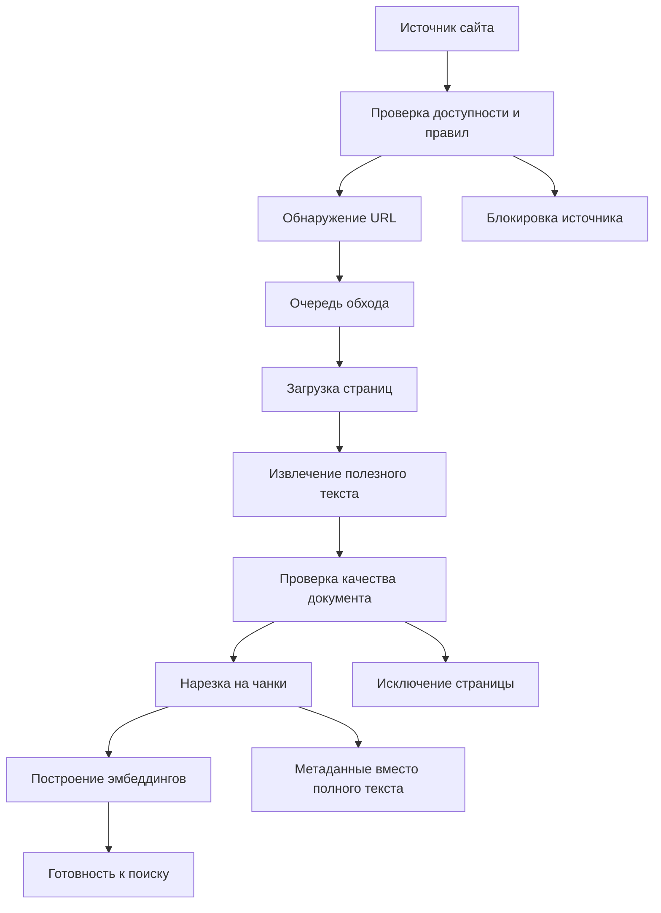

## Роли и зоны ответственности

**Администратор источников** отвечает за подключение сайта, настройку расписания переиндексации, правил отбора URL, sitemap-файлов и режима учета robots.txt.

**Система обхода** отвечает за техническую загрузку страниц, соблюдение пауз между запросами, учет ошибок HTTP, обнаружение ссылок и фиксацию статистики запуска.

**Система подготовки документов** отвечает за извлечение полезного текста, очистку навигации и технических блоков, определение дублей, определение слишком коротких или слишком больших документов.

**Система индексирования** отвечает за формирование чанков, повторное использование уже построенных эмбеддингов, маркировку дублей и отправку недостающих чанков на эмбеддинг.

**Операционный контроль** отвечает за мониторинг статусов, очередей, ошибок, исключений и результатов переиндексации.

## Основные сущности

| Сущность      | Комментарий                         | Что контролируется                                                           |
| ------------- | ----------------------------------- | ---------------------------------------------------------------------------- |
| Источник      | Подключенный сайт или домен         | Адрес, расписание, пауза, правила обхода, robots.txt, блокировка             |
| Sitemap       | Карта сайта, из которой берутся URL | Доступность, дата проверки, ETag, число URL, причина исключения              |
| Страница      | Конкретный URL                      | Статус обработки, HTTP-код, контент, дата обхода, период проверки            |
| Связь страниц | Найденная ссылка между страницами   | Источник ссылки, целевой URL, принадлежность к источнику                     |
| Запуск обхода | Один цикл обработки источника       | Начало, завершение, число новых, измененных, ошибочных и исключенных страниц |
| Чанк          | Фрагмент документа для поиска       | Текст, тип, раздел, токены, дубль, наличие эмбеддинга                        |
| Шингл         | Отпечаток текстового блока          | Повторяющиеся блоки и шаблонный текст                                        |

## Жизненный цикл источника

Источник может находиться в одном из операционных режимов:

- **Активен** - участвует в ручном и плановом обходе.
- **На паузе** - не ставится в обход и не переиндексируется автоматически.
- **Заблокирован** - система обнаружила техническое или регламентное препятствие: DNS не резолвится, главная страница недоступна, сайт отвечает 5xx, robots.txt запрещает обход или главная страница уводит на другой домен.
- **Ручной режим** - источник не запускается по расписанию, но может быть переиндексирован вручную.

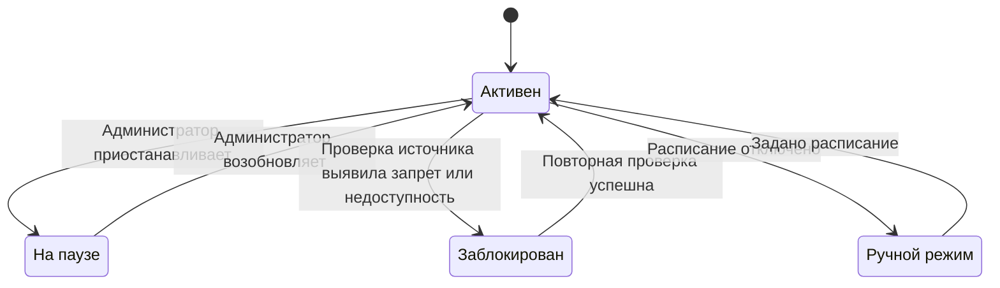

## Регламент подключения источника

При подключении источника задаются:

1. Базовый URL сайта.
2. Название источника для администрирования.
3. Расписание переиндексации в cron-формате или ручной режим.
4. Ограничения обхода: число параллельных запросов, задержка между запросами, таймаут загрузки.
5. Правила отбора URL:
   - CSS- или XPath-ограничения для поиска ссылок в конкретных областях страницы.
   - Регулярные выражения для разрешенных URL.
   - Список query-параметров, которые нужно игнорировать при нормализации URL.
6. Режим учета robots.txt.
7. Sitemap-файлы: обнаруженные автоматически или добавленные вручную.

Базовые значения для обхода консервативны: небольшая параллельность, задержка между запросами и ограниченный таймаут. Это снижает нагрузку на внешние сайты и делает поведение системы предсказуемым.

## Предварительная проверка источника

Перед обходом система проверяет, можно ли работать с источником:

1. Проверяет, что домен резолвится.
2. При необходимости читает robots.txt.
3. Проверяет, не запрещен ли обход для пользовательского агента системы.
4. Открывает главную страницу источника.
5. Проверяет, не уводит ли главная страница на другой домен.
6. Проверяет, не возвращает ли главная страница серверную ошибку.

Если проверка не пройдена, источник блокируется с понятной причиной, а страницы, ожидавшие обхода, переводятся в готовое состояние с ошибкой исключения. Это нужно, чтобы очередь не копила невыполнимые задачи.

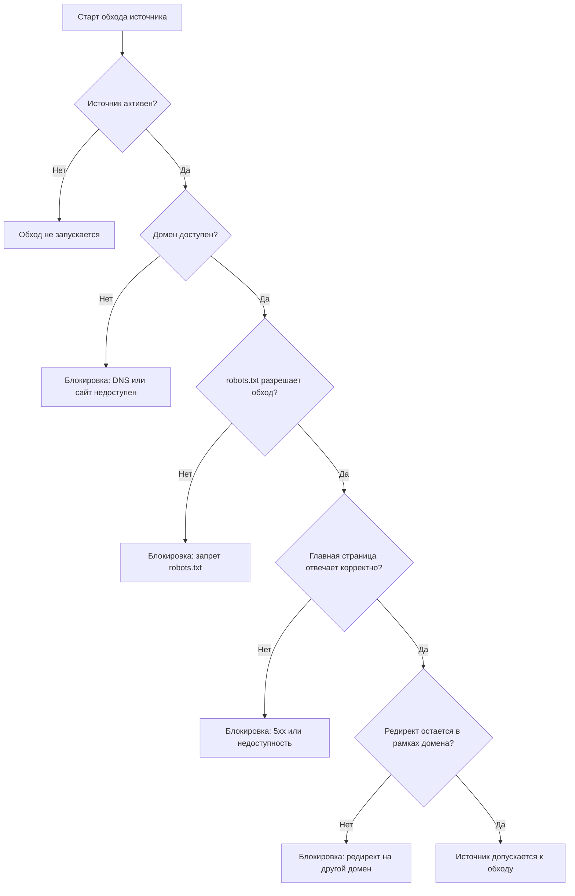

## Регламент обнаружения URL

URL попадают в систему тремя путями:

1. **Стартовый URL источника** - базовая точка обхода.
2. **Sitemap** - структурированный список страниц, заявленный сайтом.
3. **Ссылки со страниц** - URL, найденные во время обхода.

Все URL перед постановкой в очередь нормализуются:

- удаляется фрагмент после `#`;
- отбрасываются query-параметры, объявленные как незначимые;
- применяется единый формат адреса;
- проверяются разрешающие правила источника;
- исключаются повторы.

Если один домен соответствует нескольким подключенным источникам, система определяет принадлежность страницы по домену и назначает ее соответствующему источнику. Это позволяет корректно работать с несколькими сайтами в одном проекте.

## Регламент работы с sitemap

Sitemap используется как управляемый источник адресов. Система работает с ним по правилам:

1. Sitemap ищется в robots.txt.
2. Если в robots.txt нет ссылок на sitemap и ранее не было известных sitemap, система пробует стандартные адреса.
3. Администратор может добавить sitemap вручную.
4. Sitemap принимается только в рамках домена источника.
5. Sitemap с редиректом, пустым телом, неверным доменом или HTTP-ошибкой исключается с причиной.
6. Повторная проверка sitemap не выполняется чаще одного раза в сутки, если нет необходимости восстановить страницы.
7. Для экономии трафика используется условная проверка по ETag, когда сайт ее поддерживает.
8. Если sitemap является индексом, из него извлекаются дочерние sitemap.
9. Если у страницы в sitemap обновился `lastmod`, страница получает повышенный приоритет на ближайший обход.

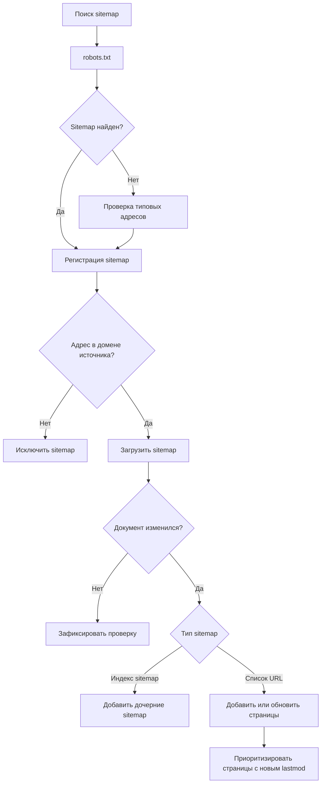

## Очередь обхода страниц

Очередь обхода строится не как простой список, а как приоритетная выборка из трех корзин:

| Корзина | Доля бюджета | Назначение                                                                       |
| ------- | -----------: | -------------------------------------------------------------------------------- |
| A       |          20% | Хабовые страницы, важные для обнаружения новых ссылок                            |
| B       |          60% | Новые страницы, явно ожидающие обхода, и страницы с истекшим интервалом проверки |
| C       |          20% | Повторная попытка для страниц с серверными ошибками 5xx                          |

Если в какой-то корзине меньше страниц, неиспользованный бюджет перераспределяется в пользу других корзин в порядке: основная очередь, ошибки, хабовые страницы.

Такой регламент нужен, чтобы одновременно:

- поддерживать обнаружение новых страниц;
- регулярно обновлять основной корпус знаний;
- не забывать о временных серверных ошибках;
- не позволять хабовым страницам занять весь обход.

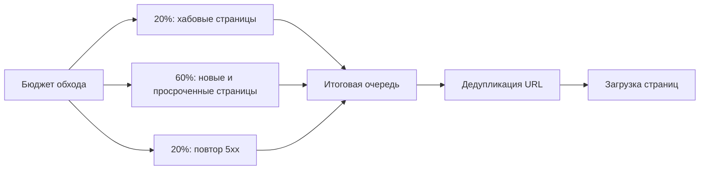

## Регламент загрузки страниц

Во время обхода система:

1. Загружает стартовую страницу источника.
2. Загружает приоритетные страницы из очереди.
3. Соблюдает ограничения источника по параллельности, задержке и таймауту.
4. Фиксирует HTTP-статус, ETag, финальный URL, тип содержимого и исходное тело ответа.
5. Из HTML-страниц извлекает ссылки для дальнейшего обхода.
6. Определяет язык и дату публикации или изменения, если эти данные есть в заголовках или метаданных страницы.
7. Передает загруженный результат в контур подготовки документа.

Если три последних запуска источника были ограничены сайтом, задержка между запросами автоматически увеличивается, но не выше заданного защитного предела. Это снижает риск блокировки со стороны сайта.

## Регламент обработки ошибок загрузки

Ошибки не скрываются и не превращаются в успешные документы.

| Ситуация                                  | Решение                                                 |
| ----------------------------------------- | ------------------------------------------------------- |
| Редирект на авторизацию                   | Страница исключается как требующая входа                |
| HTTP 4xx без полезного текста             | Страница получает ошибку клиентского уровня             |
| HTTP 4xx с извлекаемым содержимым         | Содержимое может быть принято как полезный документ     |
| HTTP 5xx                                  | Страница остается кандидатом на повторный обход         |
| Пустой результат извлечения               | Страница исключается как не содержащая полезного текста |
| Ошибка извлечения                         | Страница фиксируется с ошибкой обработки                |
| Повторяющиеся 404/410 без входящих ссылок | Страница может быть удалена как устаревшая сирота       |

## Подготовка документа

После загрузки страница переводится в нормализованный документ:

1. HTML очищается от навигации, шапок, подвалов, рекламных блоков, форм авторизации и других технических элементов.
2. Текст преобразуется в устойчивую структурированную форму.
3. Для PDF и DOCX извлекается текст и базовые метаданные.
4. Для неподдерживаемых или поврежденных файлов фиксируется ошибка извлечения.
5. Заголовок нормализуется: слишком длинные, технические или явно ошибочные заголовки не принимаются.
6. Строится структура документа: заголовки, абзацы, списки, таблицы, кодовые блоки.
7. Вычисляется хеш содержимого для контроля изменений.

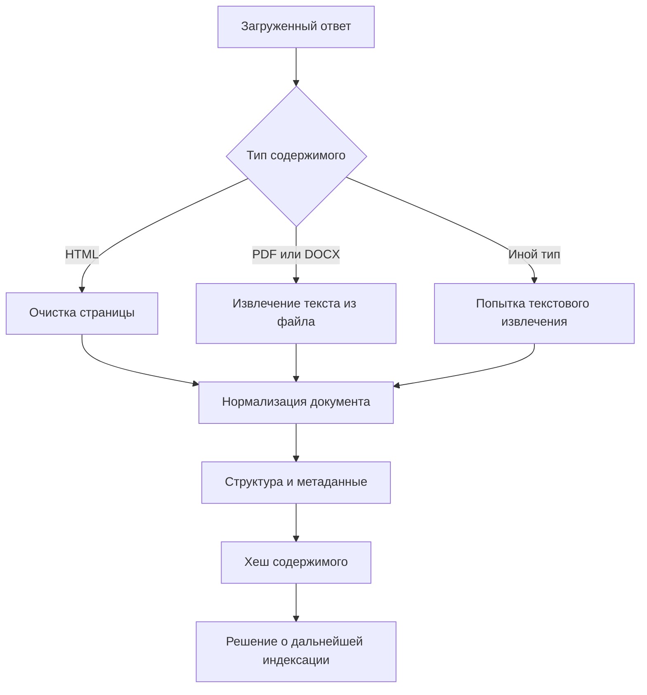

## Критерии качества документа

Документ не допускается к полноценной индексации, если выполняется одно из условий:

- полезного текста нет;
- текста слишком мало для безопасной индексации;
- документ слишком большой для штатной обработки;
- документ полностью совпадает с другой страницей этого же источника;
- страница заблокирована правилами источника;
- страница заблокирована robots.txt;
- страница требует авторизации;
- извлечение содержимого завершилось ошибкой.

Для исключенных страниц удаляются ранее построенные чанки, чтобы поисковая база не использовала устаревшие или запрещенные данные.

## Работа с дубликатами

Система различает два вида дублей:

1. **Полный дубль страницы** - документ полностью совпадает с другой страницей того же источника. В этом случае выбирается каноническая страница, а дубль исключается из индекса.
2. **Дубль чанка** - отдельный фрагмент текста повторяется в разных документах. Такой чанк маркируется как дубль, эмбеддинг для него не строится повторно.

Каноническая страница выбирается так, чтобы предпочтение получал более короткий и стабильный URL. Это снижает шум от технических вариантов страниц.

## Адаптивный интервал проверки страниц

После каждого успешного обхода страница получает следующий интервал проверки:

- если содержимое изменилось, интервал сокращается;
- если содержимое не изменилось, интервал увеличивается;
- минимальный интервал ограничен одним днем;
- максимальный интервал ограничен девяноста днями;
- при устойчивых 4xx-ошибках интервал также увеличивается, чтобы не тратить ресурс на заведомо проблемные страницы.

Такой регламент позволяет чаще проверять изменяющиеся материалы и реже трогать стабильные страницы.

## Статусы страниц

Страница проходит три основных статуса:

| Статус  | Значение                                                                |
| ------- | ----------------------------------------------------------------------- |
| crawler | Страница ожидает обхода или повторной загрузки                          |
| parsing | Содержимое загружено и готовится к индексации                           |
| ready   | Страница обработана; она либо доступна поиску, либо корректно исключена |

Ошибки и исключения хранятся отдельно от основного статуса. Это позволяет странице быть операционно завершенной, но при этом иметь причину, почему она не участвует в поиске.

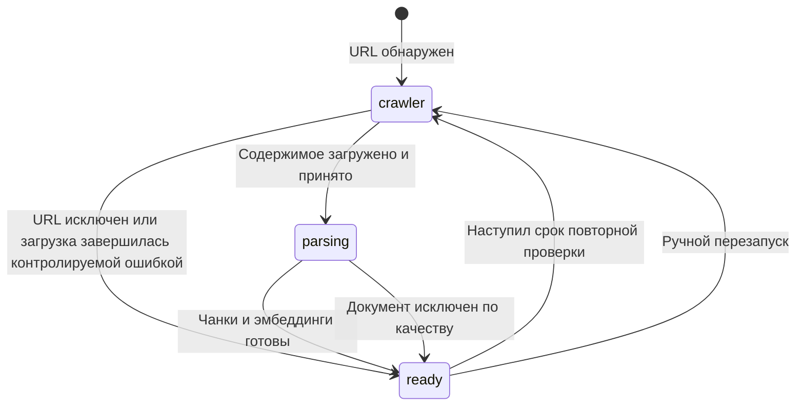

## Причины исключения и ошибок

| Причина                    | Что означает                                                     |
| -------------------------- | ---------------------------------------------------------------- |
| HTTP 4xx                   | Страница не отдается клиенту или отсутствует                     |
| HTTP 5xx                   | Сайт временно или стабильно ошибается на сервере                 |
| Домен не резолвится        | Источник технически недоступен на уровне DNS                     |
| Сайт недоступен            | Главная страница не открывается                                  |
| Редирект на другой домен   | Источник больше не соответствует ожидаемому домену               |
| Запрет robots.txt          | Сайт явно запрещает обход                                        |
| Запрет правилами источника | URL не соответствует регламенту подключения                      |
| Требуется авторизация      | Страница недоступна без входа                                    |
| Исключено вручную          | Администратор исключил документ                                  |
| Дубликат содержимого       | Такая же страница уже есть в источнике                           |
| Нет полезного текста       | После очистки не осталось индексируемого текста                  |
| Мало содержимого           | Текст слишком короткий и может ухудшить качество поиска          |
| Слишком большой документ   | Документ превышает безопасный объем обработки                    |
| Ошибка извлечения          | Содержимое не удалось преобразовать в документ                   |
| Ошибка эмбеддера           | Документ принят, но не удалось построить поисковое представление |

## Построение поискового индекса

Индексация начинается после того, как документ сохранен и признан пригодным.

Процесс:

1. Проверяется, изменилось ли содержимое с момента последней индексации.
2. Если текущие чанки уже соответствуют текущему содержимому, повторная нарезка не выполняется.
3. Если документ новый или изменился, старые чанки удаляются.
4. Документ нарезается на чанки с учетом структуры, заголовков, разделов и токенов.
5. Повторяющиеся шаблонные фрагменты сайта учитываются отдельно и по возможности исключаются из смысловой нарезки.
6. Для каждого чанка считается текстовый хеш.
7. Если такой же чанк уже имеет эмбеддинг, он переиспользуется.
8. Дублирующиеся чанки маркируются и не отправляются на повторное построение эмбеддингов.
9. Недостающие эмбеддинги ставятся в очередь.
10. Когда у всех недублирующихся чанков есть эмбеддинги, страница считается готовой.

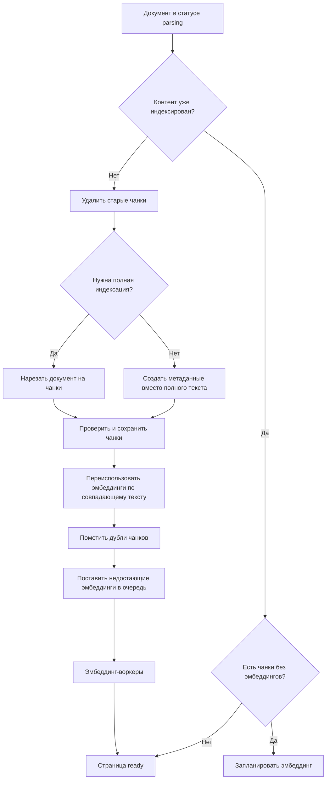

## Индексация только метаданных

Для части документов система не индексирует полный текст, а создает краткий служебный чанк с метаданными. Это применяется, когда полный текст может ухудшить качество или перегрузить обработку:

- большие CSV/TSV и статистические выгрузки;
- слишком большие скачиваемые документы;
- крупные технические файлы и кодовые активы;
- страницы, у которых есть признаки документа, но нет полезного видимого текста.

Такая политика позволяет сохранить факт наличия документа и его базовые признаки, но не засорять семантический индекс нерелевантными массивами данных.

## Повторяющиеся и шаблонные блоки

Сайты часто содержат повторяющиеся элементы: меню, футер, хлебные крошки, промо-блоки, баннеры, навигацию. Если такие блоки индексировать как обычный текст, они ухудшают качество поиска.

Для управления этим риском система:

1. Строит отпечатки текстовых блоков страниц источника.
2. Находит фрагменты, которые встречаются у значимой доли страниц.
3. Считает такие фрагменты шаблонными.
4. Учитывает их при последующей нарезке документов.

Индекс шаблонных блоков перестраивается после обхода источника.

## Очередь эмбеддингов

Эмбеддинги строятся отдельной очередью. Это сделано по двум причинам:

1. Обход сайта не должен ждать тяжелой векторной обработки.
2. Эмбеддинг можно масштабировать и контролировать независимо от очереди обхода.

Система считает число чанков без эмбеддингов, определяет необходимое число рабочих задач и ограничивает число одновременно активных задач. Это защищает инфраструктуру от всплесков после большого обхода.

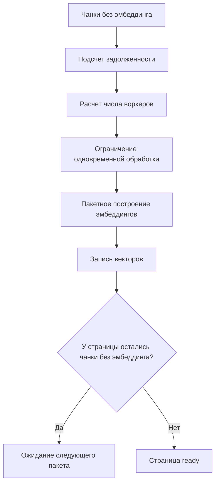

## Расписание переиндексации

Для каждого источника задается расписание:

- по умолчанию - еженедельная переиндексация в ночное окно;
- может быть установлен любой корректный cron-график;
- пустое значение или ручной режим отключает автоматическую переиндексацию.

Планировщик регулярно проверяет источники:

1. Берет только активные и не заблокированные источники.
2. Проверяет, наступило ли время очередной переиндексации.
3. Не запускает новый обход, если по источнику уже есть активный запуск.
4. Старые незавершенные запуски считает аварийно прерванными и закрывает при следующем резервировании.
5. Ставит подходящие источники в очередь обхода.

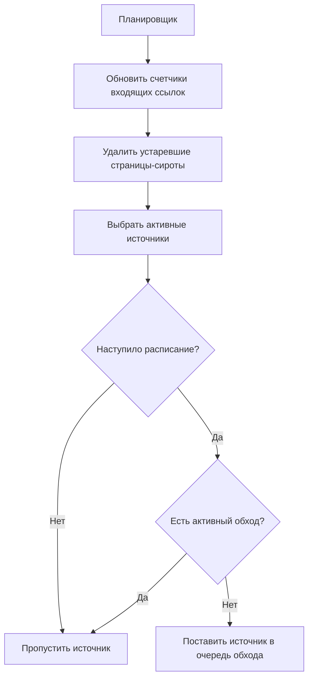

## Ручные операции администратора

Администратору доступны операции:

- запустить обход одного источника;
- запустить обход всех активных источников;
- запустить полную индексацию проекта;
- переобработать отдельный документ;
- добавить sitemap вручную;
- включить или исключить sitemap;
- удалить sitemap;
- приостановить или возобновить источник;
- изменить правила отбора URL;
- изменить расписание переиндексации;
- изменить параметры crawler-нагрузки.

Ручной запуск обхода источника выполняется как цепочка: сначала синхронизируется sitemap, затем запускается обход источника без повторной sitemap-синхронизации внутри этого же запуска. Это предотвращает лишнюю работу и делает операцию предсказуемой.

## Контроль конкурентности и идемпотентность

Система защищается от дублей задач:

- один источник не должен обходиться несколькими воркерами одновременно;
- один документ не должен материализоваться в чанки несколькими задачами одновременно;
- повторная постановка одного и того же документа в индексацию ограничивается временным ключом;
- запуск обновления проектного индекса также ограничивается временным ключом;
- эмбеддинг-воркеры имеют лимит одновременных активных задач.

Это важно для операционной устойчивости: повторный клик администратора или задержка очереди не должны создавать конфликтующие записи и лишнюю нагрузку.

## Статистика запуска обхода

Каждый запуск обхода фиксирует:

- время начала;
- время завершения;
- причину завершения;
- число новых страниц;
- число измененных страниц;
- число обработанных без изменений страниц;
- число ошибочных страниц;
- число исключенных страниц;
- признак ограничения со стороны сайта.

Эти показатели используются для мониторинга качества источника и для автоматического снижения нагрузки при признаках ограничения частоты запросов со стороны сайта.

## Операционный контур качества

Рекомендуемые контрольные вопросы для регулярного просмотра:

1. Какие источники заблокированы и по какой причине?
2. Есть ли источники, которые давно не переиндексировались?
3. Растет ли число страниц с HTTP 5xx?
4. Не увеличивается ли доля исключений по robots.txt или правилам источника?
5. Есть ли документы в состоянии подготовки дольше обычного?
6. Есть ли чанки без эмбеддингов после завершения обхода?
7. Не растет ли число дублей, пустых документов или слишком коротких страниц?
8. Не появились ли sitemap с ошибками, редиректами или неверным доменом?

## Регламент принятия результата

Индексация источника считается успешно завершенной, если:

1. Запуск обхода завершен с финальной причиной.
2. Для источника обновлена дата последней переиндексации.
3. Новые и измененные страницы либо получили чанки, либо получили понятную причину исключения.
4. Для недублирующихся чанков построены эмбеддинги.
5. Ошибочные страницы не имеют активных поисковых чанков.
6. Sitemap-ошибки и блокировки источника видны администратору.

Источник не обязательно должен иметь ноль ошибок. Важнее, чтобы каждая ошибка была классифицирована и не попадала в поиск как успешный документ.

## Сквозной сценарий

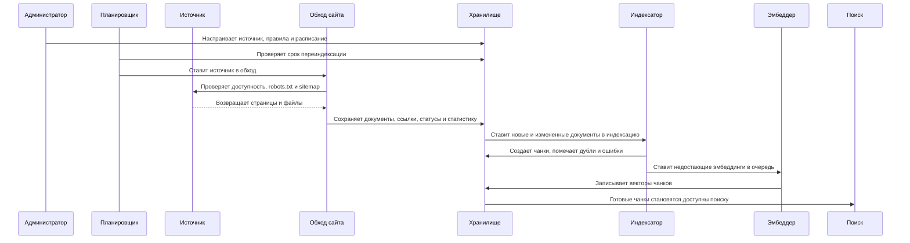

## Резюме

Индексация сайтов устроена как контролируемый регламентный процесс, а не как одноразовая загрузка страниц. Система сначала проверяет право и возможность обхода, затем управляемо обнаруживает URL, загружает страницы с учетом нагрузки, очищает и классифицирует документы, исключает низкокачественные случаи, строит поисковые фрагменты и отдельно доводит их до готовности через очередь эмбеддингов.

Главный принцип процесса: каждая страница должна прийти к одному из двух понятных финалов - быть готовой к поиску или быть исключенной с объяснимой причиной. Это делает базу знаний управляемой, проверяемой и пригодной для регулярной эксплуатации.
