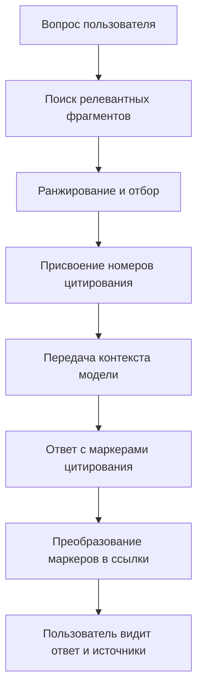
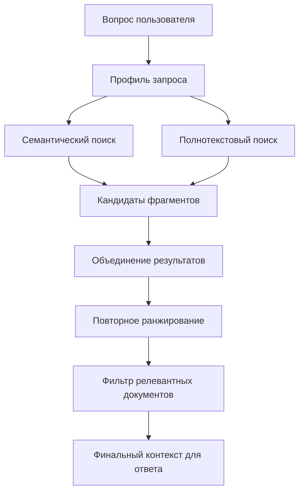
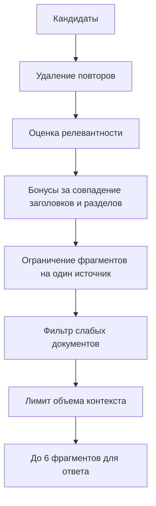
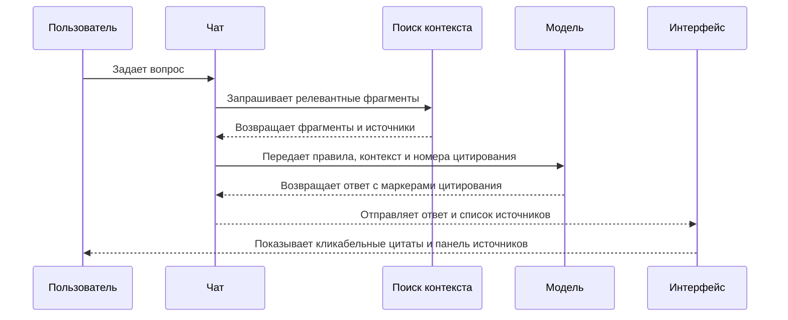
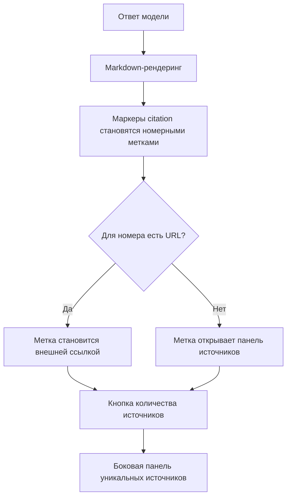
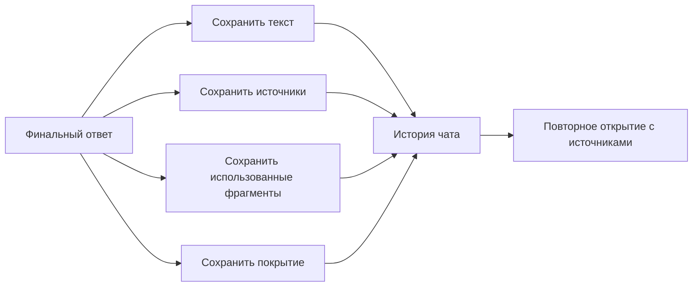
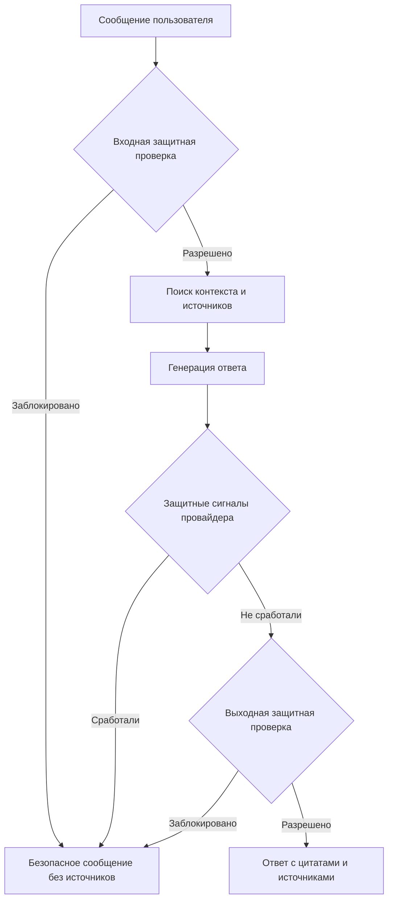
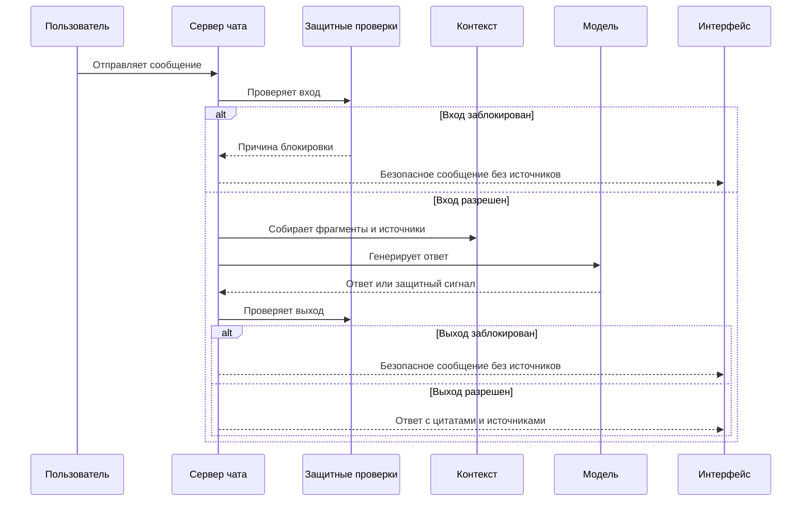
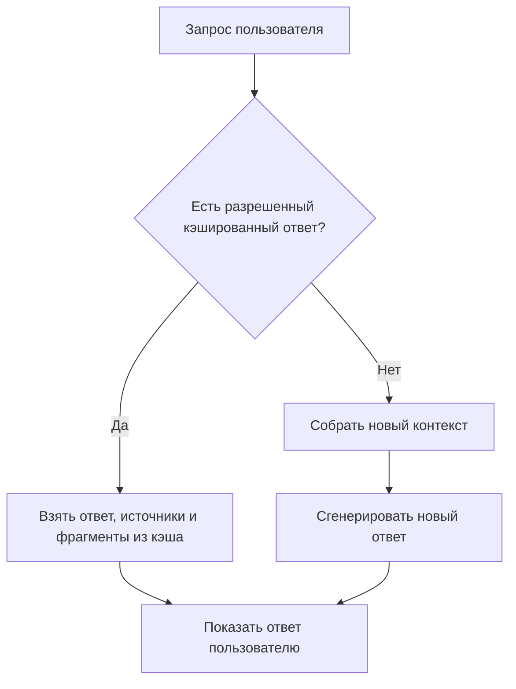
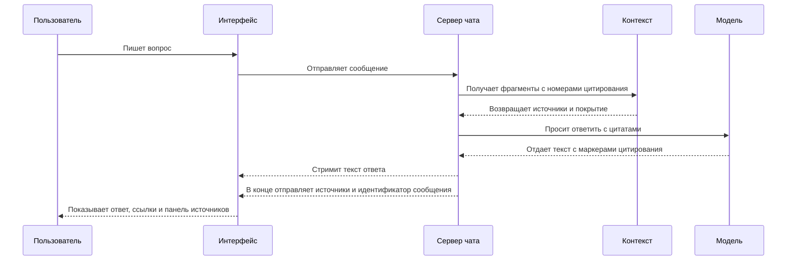

# Цитирование источников в чатах: регламент и пользовательская модель

## Назначение документа

Документ объясняет, как в чатах работает цитирование источников для пользователей: от поиска релевантных фрагментов в базе знаний до отображения кликабельных ссылок в ответе ассистента. Описание дано на русском языке, без ссылок на исходники и в управленческой терминологии.

Цитирование в чате решает три задачи:

1. Показывает пользователю, на какие материалы опирался ассистент.
2. Снижает риск неподтвержденных ответов.
3. Позволяет быстро перейти от ответа к первичному документу или странице.

## Ключевые понятия

| Понятие                 | Комментарий                                                             |
| ----------------------- | ----------------------------------------------------------------------- |
| Вопрос пользователя     | Сообщение, по которому система ищет релевантный контекст                |
| Контекст                | Набор найденных фрагментов, передаваемых модели для подготовки ответа   |
| Фрагмент                | Короткая часть документа, таблицы, раздела или файла                    |
| Номер цитирования       | Внутренний номер фрагмента в текущем ответе                             |
| Источник                | Документ или страница, из которой был получен фрагмент                  |
| Покрытие                | Оценка того, достаточно ли найденных фрагментов для ответа нужного типа |
| Пользовательская ссылка | Кликабельная метка в ответе или ссылка в панели источников              |

## Общий принцип

Цитирование строится не после ответа, а до него. Система сначала подбирает фрагменты из индексированной базы знаний, присваивает им номера, передает эти номера модели и требует использовать только их. После генерации интерфейс связывает номера из текста ответа с фактическими источниками.



## Цель цитирования

Система должна обеспечивать понятную связь между утверждением ассистента и материалом, из которого оно получено. Пользователь не должен гадать, откуда взялась информация: рядом с соответствующей частью ответа появляется номер источника, а под ответом доступен список уникальных источников.

Если релевантного контекста нет, корректное поведение - сказать, что ответ не найден в индексированных источниках. В этом случае система не должна подставлять случайные или близкие по теме источники.

## Источники данных для цитирования

Для ответа используются два типа контекста:

1. **База знаний проекта** - проиндексированные страницы, документы и файлы.
2. **История текущего чата** - релевантные сообщения и контекст диалога.

Пользовательские кликабельные источники появляются прежде всего для фрагментов базы знаний, у которых есть адрес страницы или документа. Фрагменты из истории чата могут помогать ответу, но не всегда имеют внешний URL для цитирования.

## Поиск релевантных фрагментов

Поиск выполняется комбинированно:

- семантический поиск находит фрагменты, близкие по смыслу;
- полнотекстовый поиск находит точные совпадения по словам, названиям, терминам и числам;
- для табличных запросов система повышает приоритет табличных фрагментов;
- для запросов на перечисление система старается подобрать несколько разделов или источников;
- для запросов на дословные сведения система проверяет, есть ли фрагменты с исходным URL.



## Профиль запроса

Перед поиском система определяет тип пользовательского запроса:

| Режим                         | Когда включается                                                      | Что меняется                                                    |
| ----------------------------- | --------------------------------------------------------------------- | --------------------------------------------------------------- |
| Обычный ответ                 | Пользователь задает информационный вопрос                             | Подбираются наиболее релевантные текстовые фрагменты            |
| Запрос на источник или цитату | Пользователь просит источник, цитату, дословное подтверждение         | Проверяется наличие URL и фрагментов, пригодных для цитирования |
| Табличный запрос              | Пользователь спрашивает про таблицу, строки, колонки, числовые данные | Табличные фрагменты получают больший приоритет                  |
| Перечисление                  | Пользователь просит список, все варианты или перечисление             | Система оценивает широту покрытия несколькими разделами         |

Этот профиль не виден пользователю напрямую, но влияет на то, какие источники будут выбраны и насколько уверенно система сможет их цитировать.

## Отбор и ранжирование

После первичного поиска система:

1. Объединяет результаты семантического и полнотекстового поиска.
2. Убирает явные повторы.
3. Переоценивает фрагменты по близости к вопросу.
4. Учитывает совпадения в названии документа, заголовке раздела, пути раздела и ключевых терминах.
5. Ограничивает число фрагментов от одного источника, чтобы один документ не вытеснил все остальные.
6. Отбрасывает документы, которые сильно уступают лучшему найденному документу.
7. Ограничивает общий объем контекста, чтобы ответ помещался в рабочее окно модели.



## Присвоение номеров цитирования

Каждому выбранному фрагменту присваивается номер в рамках текущего ответа. Номера начинаются с нуля внутри служебного контекста, но в интерфейсе показываются пользователю как 1, 2, 3 и так далее.

Пример внутреннего соответствия:

| Внутренний номер | Пользовательская метка | Что означает              |
| ---------------: | ---------------------: | ------------------------- |
|                0 |                      1 | Первый выбранный фрагмент |
|                1 |                      2 | Второй выбранный фрагмент |
|                2 |                      3 | Третий выбранный фрагмент |

Важно: номер цитирования действует только внутри конкретного ответа. В следующем ответе тот же документ может получить другой номер, потому что контекст собирается заново под новый вопрос.

## Что передается модели

Модель получает:

1. Системные правила ответа.
2. Историю последних сообщений чата.
3. Политику покрытия: есть ли источники, цитатные кандидаты, таблицы и достаточная широта для перечислений.
4. Список фрагментов с номерами цитирования.
5. Текущий вопрос пользователя.

Для модели действует строгий регламент:

- отвечать на языке пользователя;
- использовать только найденный контекст, если вопрос требует данных из источников;
- не придумывать идентификаторы цитирования;
- использовать только номера, которые реально есть в переданном контексте;
- не выводить отдельный список источников в конце ответа, потому что список строит интерфейс.



## Формат цитирования в ответе

Модель вставляет в текст служебный маркер вида:

```text
[[citation:0]]
```

Пользователь не должен видеть этот технический вид как основной интерфейс. На странице чата маркер превращается в компактную круглую метку с номером источника. Например, `[[citation:0]]` показывается как метка `1`.

Если для номера цитирования есть источник с URL, метка становится ссылкой на страницу или документ. Если URL нет, метка остается элементом, который открывает панель источников, но не ведет во внешний документ.

## Пользовательское отображение

После завершения ответа пользователь видит:

1. Текст ответа.
2. Небольшие номерные метки рядом с утверждениями, которые опираются на контекст.
3. Кнопку с количеством источников под ответом.
4. Боковую панель со списком уникальных источников.

Список источников дедуплицируется: если несколько фрагментов взяты из одной и той же страницы, пользователь видит эту страницу один раз в панели источников.



## Панель источников

Панель источников нужна для просмотра всех материалов, на которые опирался ответ. В ней показываются уникальные источники:

- название документа или страницы;
- ссылка на исходную страницу, если она доступна;
- один источник только один раз, даже если из него использовано несколько фрагментов.

Панель открывается при нажатии на кнопку вида “1 источник”, “2 источника”, “5 источников” или при нажатии на номер цитирования, если номер еще не преобразован в прямую ссылку.

## Сохранение цитирования в истории чата

После ответа система сохраняет:

1. Текст сообщения ассистента.
2. Список источников, использованных для ответа.
3. Список использованных фрагментов.
4. Политику покрытия.
5. Метрики покрытия.
6. Технические данные генерации, включая модель и число токенов.

Благодаря этому при повторном открытии чата пользователь видит источники рядом с уже созданными ответами, а не только во время потоковой генерации.



## Политика покрытия

Для каждого ответа система оценивает, насколько найденный контекст подходит под тип вопроса.

| Показатель               | Что показывает                                   |
| ------------------------ | ------------------------------------------------ |
| Количество фрагментов    | Сколько частей контекста попало в ответ          |
| Количество источников    | Сколько разных URL участвует в ответе            |
| Количество разделов      | Насколько широко покрыт вопрос внутри документов |
| Количество таблиц        | Есть ли табличные данные для табличного запроса  |
| Готовность к цитированию | Есть ли фрагменты с URL, пригодные для ссылки    |
| Покрытие перечисления    | Достаточно ли разделов для ответа-списка         |

Если пользователь просит источник, а подходящего URL нет, система фиксирует причину “нет URL источника”. Если пользователь просит таблицу, а табличного фрагмента нет, фиксируется нехватка табличного кандидата. Если пользователь просит полный список, но контекст покрывает только часть данных, фиксируется частичное покрытие.

## Правила, защищающие от неверных цитат

Цитирование ограничено несколькими регламентами:

1. Модель может использовать только те номера, которые получила в контексте.
2. Если ответа нет в индексированных источниках, модель должна сказать об этом и не цитировать нерелевантный материал.
3. В ответе не должно быть отдельного ручного списка источников: интерфейс строит его из проверенного списка.
4. Фрагменты перед передачей модели очищаются от потенциально опасных инструкций, чтобы текст источника не управлял поведением ассистента.
5. Повторы фрагментов и источников ограничиваются, чтобы ответ не выглядел подтвержденным большим числом одинаковых ссылок.
6. Дублирующиеся чанки не используются как самостоятельные основания для цитирования.

## Защитные проверки

В чатах подключен отдельный контур защитных проверок. Он не заменяет цитирование, но влияет на то, будет ли ответ вообще сгенерирован и будут ли показаны источники.

Защитные проверки работают в трех местах:

1. **До поиска и генерации** - проверяется сообщение пользователя. Если запрос заблокирован, система не собирает контекст, не вызывает модель для обычного ответа и не показывает источники.
2. **Во время обращения к модели** - при использовании провайдера с поддержкой встроенных защитных проверок запрос и поток ответа проходят через защитный клиент. Он может вернуть сигнал фильтрации, отказа или срабатывания защитного правила.
3. **После генерации** - проверяется уже подготовленный ответ ассистента. Если ответ заблокирован, пользователь получает безопасное сообщение без источников.



В текущем регламенте защитный контур включает:

- обнаружение российских персональных данных во входящем сообщении;
- обнаружение российских персональных данных в ответе ассистента;
- при поддержке провайдера - проверки на персональные данные, небезопасный контент, prompt injection, jailbreak и нерелевантные запросы вне клиентско-сервисного сценария;
- обработку сигналов провайдера о фильтрации содержимого или отказе.

Если защитная проверка блокирует запрос или ответ, в истории сохраняется факт срабатывания: стадия проверки, причины блокировки и безопасный ответ ассистента. Использованные фрагменты и источники при этом сохраняются пустыми, потому что пользователь не должен видеть ссылки как подтверждение заблокированного содержания.



## Когда цитата может не появиться

Цитата может отсутствовать в ответе в следующих случаях:

- вопрос является простым приветствием или технической проверкой, и поиск по базе знаний отключается;
- релевантные фрагменты не найдены;
- найденный фрагмент относится к истории чата, а не к странице с URL;
- модель корректно сообщает, что данных в источниках нет;
- защитные правила заблокировали запрос или ответ;
- найденный контекст есть, но он не содержит подтверждения конкретного утверждения.

Отсутствие цитаты в таких случаях не является ошибкой само по себе. Ошибка возникает, если ассистент делает содержательное утверждение по базе знаний без доступного подтверждения или ссылается на нерелевантный источник.

## Кэшированные ответы

Для некоторых пользовательских сценариев ответ может быть взят из кэша. В этом случае система также возвращает сохраненные источники и использованные фрагменты. Пользовательский опыт остается тем же: ответ отображается с источниками, а история сохраняет связь с материалами.



## Контроль качества цитирования

Качество цитирования проверяется по нескольким критериям:

1. Все номера цитирования в ответе должны существовать в переданном контексте.
2. Обязательные для вопроса источники должны быть процитированы, если они есть в релевантном контексте.
3. Нерелевантные источники не должны цитироваться.
4. Для вопросов без ответа ассистент должен явно сообщить, что данные не найдены, и не должен добавлять случайные цитаты.
5. Табличные и числовые ответы должны опираться на подходящие табличные или точные фрагменты.
6. При шумном контексте цитироваться должны только полезные источники, а не случайно найденные документы.

## Пользовательский сценарий



## Регламент принятия результата

Ответ считается корректно процитированным, если:

1. Все пользовательские метки источников соответствуют реально выбранным фрагментам.
2. Каждая кликабельная метка ведет на URL того же источника, которому был присвоен номер.
3. Панель источников содержит уникальные документы и страницы, использованные в ответе.
4. Источники сохраняются вместе с сообщением и восстанавливаются при открытии истории.
5. Ответ без найденного контекста не содержит выдуманных ссылок.
6. При блокировке защитными правилами пользователь получает безопасное сообщение без источников, а в истории фиксируются стадия и причины срабатывания.

## Управленческое резюме

Цитирование источников в чатах устроено как управляемая связка поиска, генерации, защитных проверок и интерфейса. Система заранее выбирает релевантные фрагменты, присваивает им номера, требует от модели ссылаться только на эти номера, сохраняет список источников и превращает технические маркеры в понятные пользователю ссылки.

Главный принцип: источник не является декоративным приложением к ответу. Он должен быть проверяемой связью между конкретным утверждением ассистента и конкретным фрагментом индексированного материала.
