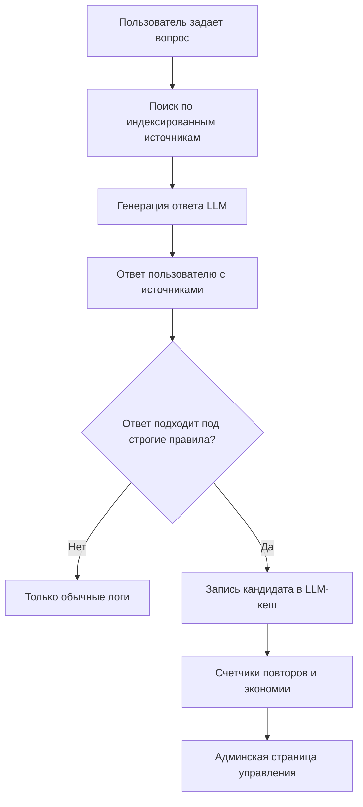
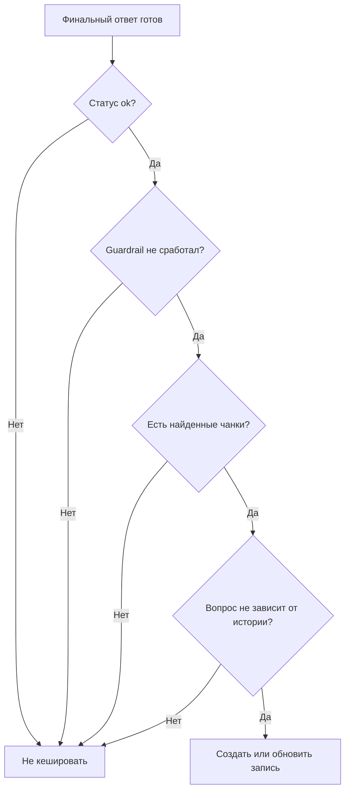
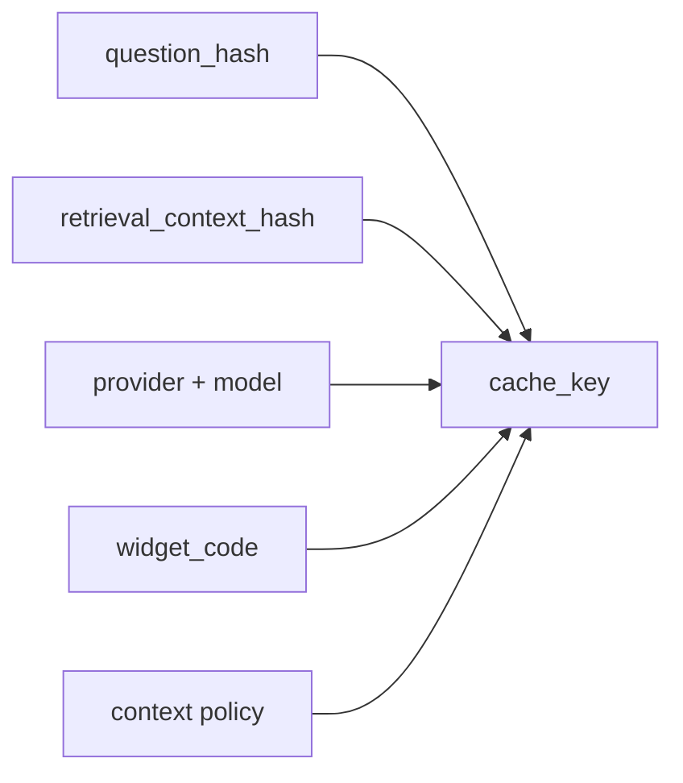
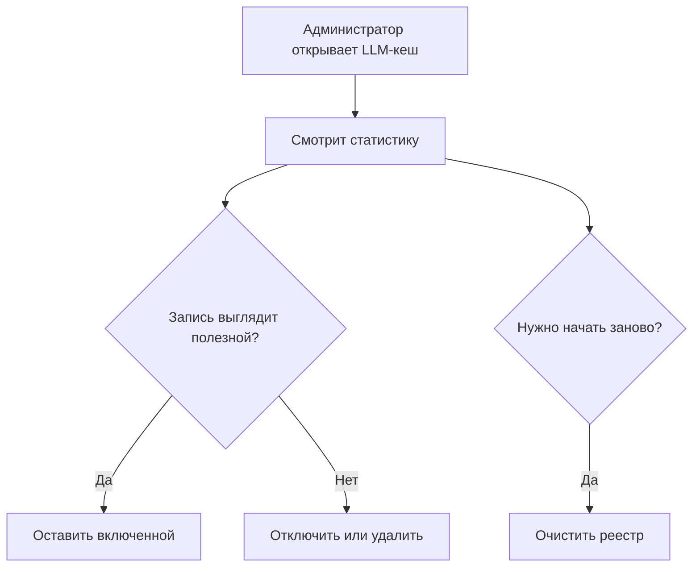
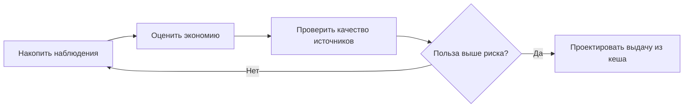

# Контур LLM-кеша: наблюдение, экономия и управление

## Назначение документа

Документ описывает, как в проекте устроен первый контур кеширования LLM-ответов.
Описание дано на уровне операционной модели: какие данные фиксируются, как
считается потенциальная экономия, какие решения может принять администратор и
почему система пока не отдает публичные ответы напрямую из нового кеша.

Этот контур не является глобальным семантическим кешем. Его задача - найти
редкие, но надежные повторяющиеся случаи, где вопрос, найденные источники,
модель и правила ответа совпали достаточно строго.

## Цель контура

Контур решает четыре задачи:

1. Наблюдать, какие публичные вопросы технически подходят для кеширования.
2. Показывать потенциальную экономию запросов к LLM и токенов.
3. Дать администратору возможность отключать, включать, удалять и очищать
   кешированные записи.
4. Подготовить безопасную основу для будущего включения выдачи из кеша, если
   фактические данные покажут пользу.

Главный принцип: лучше пропустить возможную экономию, чем вернуть пользователю
устаревший или нерелевантный ответ фонда.

## Что считается кандидатом

Запись попадает в реестр LLM-кеша только при выполнении строгих условий:

1. Ответ успешно сгенерирован.
2. Защитные правила не заблокировали запрос или ответ.
3. Вопрос не зависит от длинной истории диалога.
4. Для ответа были найдены чанки из индексированных источников.
5. Система не считает контекст отсутствующим или неполным.

Если хотя бы одно условие не выполнено, запись не создается. Такие обращения
остаются в обычных логах и метриках, но не становятся кандидатом на кеширование.

## Какие данные хранит система

Система не хранит в реестре сырой текст вопроса пользователя. Вместо него
хранится `question_hash` - хеш нормализованного вопроса. Это позволяет считать
повторы без лишнего копирования пользовательского текста.

| Поле | Назначение |
| ---- | ---------- |
| `purpose` | Тип кеша. Сейчас используется `chat_answer`. |
| `cache_key` | Строгий технический ключ записи. |
| `question_hash` | Хеш нормализованного вопроса пользователя. |
| `retrieval_context_hash` | Отпечаток найденных чанков и страниц. |
| `key_payload` | Расшифровка того, из чего собран `cache_key`. |
| `response_payload` | Ответ, источники, покрытие и политика контекста. |
| `source_scope` | Сводка по виджету, источникам, страницам и чанкам. |
| `provider` и `model` | Провайдер и модель, которыми был сгенерирован ответ. |
| `tokens` | Расход токенов на последний зафиксированный ответ. |
| `observed_count` | Сколько раз был замечен тот же строгий ключ. |
| `potential_saved_requests` | Сколько LLM-запросов можно было бы не делать после первого наблюдения. |
| `potential_saved_tokens` | Сколько токенов потенциально можно было бы сэкономить. |
| `is_enabled` | Разрешена ли запись для будущего использования. |
| `disabled_reason` | Причина отключения, например ручное отключение. |
| `first_seen_at` и `last_seen_at` | Когда запись впервые и последний раз встретилась. |

## Как строится строгий ключ

`cache_key` строится не только по вопросу. В него входят технические признаки,
от которых зависит корректность ответа:

- хеш нормализованного вопроса;
- отпечаток найденного RAG-контекста;
- провайдер и модель;
- код виджета, если вопрос пришел через конкретный виджет;
- причина политики контекста.

Это защищает от ситуации, когда одинаковая фраза пользователя относится к
разным страницам, программам, конкурсам или источникам.

## Как считается потенциальная экономия

Первое наблюдение строгого ключа создает запись, но не считается экономией:
система все равно должна была вызвать LLM, чтобы получить ответ.

Каждое следующее наблюдение того же ключа увеличивает:

- `observed_count` на 1;
- `potential_saved_requests` на 1;
- `potential_saved_tokens` на число токенов последнего ответа.

Пример:

| Событие | Что происходит |
| ------- | -------------- |
| Первый одинаковый вопрос | Создается запись, экономия равна 0. |
| Второй одинаковый вопрос | Потенциально можно было бы сэкономить 1 LLM-запрос. |
| Третий одинаковый вопрос | Потенциально можно было бы сэкономить уже 2 LLM-запроса. |

Показатели называются потенциальными, потому что на этом этапе система еще не
отдает публичный ответ из нового кеша. Она только собирает доказательства, где
кеш действительно может дать пользу.

## Админская страница

В интерфейсе администратора добавлена страница **LLM-кеш**.

На странице доступны:

1. Общее количество записей.
2. Количество включенных записей.
3. Общее количество наблюдений.
4. Потенциально сэкономленные LLM-запросы.
5. Потенциально сэкономленные токены.
6. Таблица последних 100 кандидатов.
7. Ручные действия с записью: включить, отключить, удалить.
8. Полная очистка реестра LLM-кеша.

Очистка реестра не удаляет историю чатов, страницы, чанки, источники или
триггеры. Она удаляет только наблюдения LLM-кеша.

## Почему не включен semantic cache

Подходы вроде GPTCache полезны как архитектурная подсказка: они разделяют
нормализацию запроса, хранение результата, поиск похожих вопросов, оценку
похожести и метрики. Но для публичного RAG-виджета фонда семантическое
совпадение вопроса само по себе рискованно.

Похожие вопросы могут требовать разных ответов:

- "как подать заявку?" на странице конкурса и на странице курса;
- "какие сроки?" для новости, архива и текущей программы;
- "что делать родителям?" для разных возрастов, материалов и источников.

Поэтому первая версия использует строгий exact-подход: совпасть должен не
только вопрос, но и найденный контекст, модель и правила ответа.

## Что уже делает система

В текущей реализации система:

1. Логирует признаки кандидата в событии `chat_user_request`.
2. Создает таблицу `llm_cache_entry`.
3. После успешного ответа записывает кандидата или обновляет существующую
   запись по строгому ключу.
4. Считает потенциальную экономию по повторным наблюдениям.
5. Показывает записи и сводные показатели в админке.
6. Позволяет вручную управлять записями.

## Что система пока не делает

Система пока не:

- отдает публичный ответ из нового LLM-кеша;
- считает похожие естественно-языковые вопросы одинаковыми;
- использует технический идентификатор пользователя как профиль;
- подменяет ошибки LLM-провайдера устаревшим ответом;
- кеширует заблокированные или небезопасные ответы как успешные.

Такое ограничение нужно, чтобы сначала увидеть реальную повторяемость вопросов
и оценить экономический эффект без риска для качества ответа.

## Условия для следующего этапа

Переход к фактической выдаче из кеша стоит рассматривать только если:

1. В реестре накопились повторяющиеся записи с ненулевой экономией.
2. Нет признаков, что повторные ответы ведут к неправильным источникам.
3. Администратор может отключать спорные записи.
4. Понятны правила срока жизни для разных типов контента.
5. Есть отдельное решение, что делать при ошибке LLM-провайдера.

## Операционные показатели

Для оценки контура важны не только попадания в кеш, но и качество:

- сколько строгих кандидатов появляется в сутки;
- сколько записей получают повторные наблюдения;
- сколько LLM-запросов и токенов потенциально экономится;
- какие виджеты и источники дают повторяемость;
- сколько записей администратор отключил или удалил;
- нет ли жалоб на ответы с неправильными источниками.

Если повторяемость окажется низкой, это не ошибка реализации. Это полезный
результат измерения: значит, автоматическая выдача из кеша не должна становиться
приоритетом, а экономию нужно искать в других стадиях, например в поиске,
rerank, генерации подсказок или оптимизации prompt.
